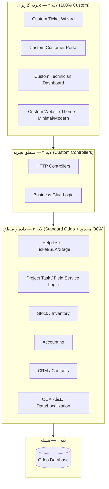

# DOC-036 — OCA Minimization & Presentation Layer Customization Strategy

**Status:** LOCKED
**Phase:** Phase 3 (Addendum to DOC-012, DOC-018, DOC-025)
**Document Type:** Architecture Decision Record

---

# 1. Objective

این سند اصل «حداقل‌سازی OCA» و «سفارشی‌سازی کامل لایه نمایش (Presentation Layer)» را که در DOC-012، DOC-018 و DOC-025 به‌صورت کلی مطرح شده بود، دقیق‌تر و قابل اجرا می‌کند.

جمع‌بندی خواسته اصلی پروژه:

> از فرم‌ها و قالب‌های آماده (چه Odoo Website Builder، چه OCA UI Modules) استفاده نمی‌کنیم.
> فقط **مدل داده و منطق بک‌اند** ماژول‌های استاندارد Odoo (و در موارد ضروری OCA) استفاده می‌شود.
> تمام فرم‌ها، صفحات و تجربه کاربری — از جمله فرم تیکت و وب‌سایت — به‌صورت کاملاً اختصاصی، مینیمال و مدرن طراحی می‌شوند.

---

# 2. Core Principle (Refined)

اصل قبلی در DOC-025:

```
Odoo Core Process = Standard
Business Experience = Custom
```

اصل تکمیل‌شده:

```
Odoo Core Data Model      = Standard   (بدون تغییر)
Odoo Core Business Logic  = Standard   (بدون تغییر)
Odoo Core Process Engine  = Standard   (Helpdesk / Task / Stock / Accounting)

Odoo Backend UI (Forms/Views/Website Builder Snippets) = Not Used by End Users
OCA UI/Portal/Theme Modules                            = Not Used

Every screen the Customer / Technician / Guest sees = 100% Custom
```

به بیان ساده: **Odoo فقط موتور و پایگاه داده است؛ هیچ‌کس (به‌جز Admin/Backoffice) صفحه‌ی استاندارد Odoo را نمی‌بیند.**

---

# 3. OCA Usage Boundary (Tightened)

OCA در این پروژه **فقط در لایه Data / Business Logic** مجاز است، نه در لایه UI.

## 3.1 مجاز (Allowed)

| نوع OCA Module | مثال | دلیل مجاز بودن |
|---|---|---|
| Data / Model Extension | افزودن فیلد یا منطق SLA به مدل Helpdesk | تغییر مدل داده، نه UI |
| Localization (بک‌اند) | تقویم جلالی، ساختار حسابداری ایران | نیاز واقعی بومی‌سازی، بدون فرم اضافه |
| Business Logic Utility | محاسبات، Report Engine بک‌اند | خروجی از طریق UI اختصاصی مصرف می‌شود |

## 3.2 غیرمجاز (Not Allowed)

| نوع OCA Module | دلیل رد شدن |
|---|---|
| OCA Portal Templates | UI آماده = خلاف اصل Custom Experience |
| OCA Website Themes / Snippets | UI آماده، غیر Minimal، غیر قابل کنترل کامل |
| OCA Helpdesk Portal / Ticket Form | دقیقاً همان چیزی که با Ticket Wizard جایگزین می‌شود |
| OCA Dashboard Widgets | جایگزین با Custom Dashboard (DOC-029 تا DOC-032) |

## 3.3 قاعده تصمیم‌گیری

```
نیاز جدید داریم؟
   │
   ├─ آیا مدل داده / منطق بک‌اند Odoo آن را پوشش می‌دهد؟ ──► استفاده از Odoo Standard
   │
   ├─ آیا فقط منطق داده/بک‌اند کم است (نه UI)؟ ──► بررسی OCA (فقط Data Layer)
   │
   └─ آیا نیاز به UI/فرم/صفحه دارد؟ ──► همیشه Custom Development
                                          (هرگز OCA UI و هرگز Website Builder Snippet)
```

---

# 4. Ticket Form — Fully Custom (تدقیق DOC-025.A)

## 4.1 تصمیم

فرم ثبت/مشاهده/پیگیری Ticket **هیچ ارتباط بصری با فرم استاندارد Helpdesk یا هر OCA Portal Template ندارد.**

## 4.2 معماری

```
[ Custom Ticket Wizard (QWeb + Owl/JS اختصاصی) ]
                │  فقط از طریق ORM / Controller
                ▼
[ Odoo Helpdesk Ticket Model (Standard, بدون تغییر ساختار Backend) ]
                │
                ▼
[ SLA Engine / Stage / Assignment (Standard Helpdesk) ]
```

- Frontend: صفحه/کامپوننت اختصاصی (HTML/QWeb + CSS مینیمال + JS ماژولار)
- Backend: `helpdesk.ticket` استاندارد به‌عنوان مخزن داده و موتور SLA/Stage
- هیچ View استاندارد Odoo (Form/Kanban Backend) مستقیماً به کاربر نهایی نمایش داده نمی‌شود.
- Controller اختصاصی (`http.Controller`) بین UI و ORM قرار می‌گیرد؛ نه Website Builder Form، نه Portal Template پیش‌فرض.

## 4.3 اصول طراحی فرم تیکت

- Wizard چندمرحله‌ای (Step by Step) به‌جای فرم طولانی
- انتخاب Asset از پروفایل مشتری (نه ورودی آزاد متن)
- پیش‌نمایش SLA پیش از ثبت (Read-only، محاسبه‌شده از بک‌اند)
- طراحی Mobile First، Large Click Area (مطابق DOC-018 بخش ۸)

---

# 5. Website Strategy — Odoo Engine, 100% Custom Theme

## 5.1 تصمیم

از **موتور Website Odoo** (Routing، Multi-language، SEO، Asset Bundling) استفاده می‌شود،
اما **Website Builder / Snippets / قالب پیش‌فرض هیچ‌گاه در صفحات کاربردی استفاده نمی‌شود.**

## 5.2 تفکیک لایه‌ها

| لایه | استفاده از Odoo Website Builder | استفاده از Custom Theme |
|---|---|---|
| صفحات ثابت بازاریابی (Home معرفی، About، Contact) | ✅ مجاز (محتوای ساده، کم‌تغییر) | اختیاری برای هماهنگی بصری |
| Login / Register | ❌ | ✅ کاملاً اختصاصی |
| Service Portal / Customer Portal | ❌ | ✅ کاملاً اختصاصی (QWeb Template مستقل) |
| Ticket Wizard | ❌ | ✅ کاملاً اختصاصی |
| Dashboardها (Admin/Manager/Technician) | ❌ | ✅ کاملاً اختصاصی |
| Marketplace | ❌ (فقط زیرساخت Routing از Website) | ✅ کاملاً اختصاصی |

> حتی برای صفحات ثابت، در صورت امکان از یک Custom Theme یکپارچه استفاده می‌شود تا تجربه بصری کاملاً یکدست بماند.

## 5.3 اصول طراحی تم اختصاصی (Minimal / Modern)

- **Design Tokens** مستقل: رنگ، تایپوگرافی، Spacing، Radius — تعریف‌شده در یک Theme Module اختصاصی (`pps_theme`)
- **Flat & Minimal**: بدون گرادیان اضافه، بدون Shadow سنگین، فضای سفید کافی
- **Component-Based**: کامپوننت‌های UI (Button، Card، Badge، Stepper) یکبار ساخته و در همه صفحات بازاستفاده می‌شوند
- **بدون وابستگی به Bootstrap پیش‌فرض Odoo Website برای صفحات کاربردی** (فقط CSS Reset/Grid حداقلی در صورت نیاز)
- **RTL Native**: طراحی از پایه برای فارسی/RTL، نه Patch روی تم LTR
- **Dark/Light Palette** آماده برای توسعه آینده (حتی اگر فاز ۱ فقط Light باشد)

## 5.4 محدودیت آگاهانه (Trade-off صریح)

- سرعت توسعه اولیه صفحات ثابت کمی کندتر از استفاده از Snippet خواهد بود.
- در ازای آن: کنترل کامل روی UX، عدم وابستگی به ساختار داده Snippetهای Odoo، و Upgrade-Safety بالاتر به‌دست می‌آید.

---

# 6. Module Impact Summary

| ماژول اختصاصی | نقش | وابستگی Backend |
|---|---|---|
| `pps_theme` | Design System + Assets مشترک | ندارد (فقط Frontend) |
| `pps_ticket_wizard` | فرم اختصاصی ثبت/پیگیری تیکت | `helpdesk.ticket` (Standard) |
| `pps_portal` | Customer Portal اختصاصی | `portal`, `helpdesk`, `sale.subscription`/Contract, `account` |
| `pps_dashboard` | Dashboardهای نقش‌محور | `project.task`, `helpdesk.ticket`, `hr.timesheet` |
| `pps_notification` | مرکز اطلاع‌رسانی اختصاصی | `mail`, `bus` |

هیچ‌یک از ماژول‌های بالا Core Odoo یا مدل داده Helpdesk/Task/Stock/Accounting را تغییر نمی‌دهند — فقط لایه نمایش و منطق تجربه کاربری را می‌سازند (مطابق اصل DOC-025 بخش ۲).

---

# 7. Diagram — Layered Architecture (Updated)



---

# 8. Final Decisions

✅ OCA فقط در لایه داده/منطق بک‌اند مجاز است؛ هیچ OCA UI/Theme/Portal Module استفاده نمی‌شود.
✅ فرم تیکت به‌طور کامل اختصاصی است و از Odoo Standard Ticket Form یا OCA Portal Form استفاده نمی‌کند.
✅ Website از موتور Odoo استفاده می‌کند اما Snippet/Builder برای صفحات کاربردی ممنوع است.
✅ یک Design System اختصاصی (`pps_theme`) پایه تمام صفحات قرار می‌گیرد.
✅ تمام صفحات کاربر نهایی (Customer/Technician/Guest) اختصاصی، Mobile First، Minimal و RTL Native هستند.
✅ Backoffice/Admin همچنان می‌تواند از Odoo Backend استاندارد استفاده کند (این سند شامل کاربران نهایی است، نه تیم داخلی عملیات).

---

# 9. Resolved Decisions (تصمیمات نهایی)

## 9.1 صفحات ثابت بازاریابی (About / Contact)

**تصمیم:** استفاده از **Website Builder استاندارد اودو** مجاز است، چون:

- این صفحات منطق کسب‌وکار یا داده اختصاصی ندارند (صرفاً محتوای معرفی/تماس).
- سرعت پیاده‌سازی در این بخش اولویت دارد (طبق تصمیم پروژه).
- ریسک Upgrade این صفحات پایین است — تغییر آینده در آن‌ها هزینه کمی دارد.

**محدودیت:** Design Token های پایه (رنگ/تایپوگرافی از `pps_theme`) حتی در این صفحات باید اعمال شوند تا یکپارچگی بصری با بقیه سایت حفظ شود؛ فقط ساختار Layout/Snippet آزاد است، نه رنگ و فونت.

این تصمیم بند ۵.۲ جدول را به‌روزرسانی می‌کند:

| لایه | استفاده از Odoo Website Builder | استفاده از Custom Theme |
|---|---|---|
| صفحات ثابت بازاریابی (Home معرفی، About، Contact) | ✅ **مجاز** (سرعت اولویت دارد) | ✅ Design Tokens الزامی (رنگ/فونت) |

## 9.2 Design System برای Marketplace

**تصمیم:** Marketplace از همان `pps_theme` استفاده می‌کند — **بدون Design System جداگانه.**

دلیل: یکپارچگی تجربه کاربری بین Portal، Ticket Wizard و Marketplace؛ کاهش هزینه نگهداری Design System موازی.

جدول بخش ۶ (Module Impact Summary) بدون تغییر باقی می‌ماند — `pps_theme` مسئول تمام سطوح UI از جمله Marketplace است.

---

# 10. Final Status

با حل شدن دو سؤال باز فوق، این سند نهایی می‌شود.

✅ صفحات بازاریابی ساده: Website Builder مجاز، با Design Tokens اجباری.
✅ صفحات کاربردی (Login, Portal, Ticket Wizard, Dashboard, Marketplace): همچنان ۱۰۰٪ اختصاصی طبق بخش ۵ و ۶.
✅ یک `pps_theme` واحد برای کل پروژه، بدون Design System جدا برای Marketplace.

---

# DOC-036 — LOCKED ✅
