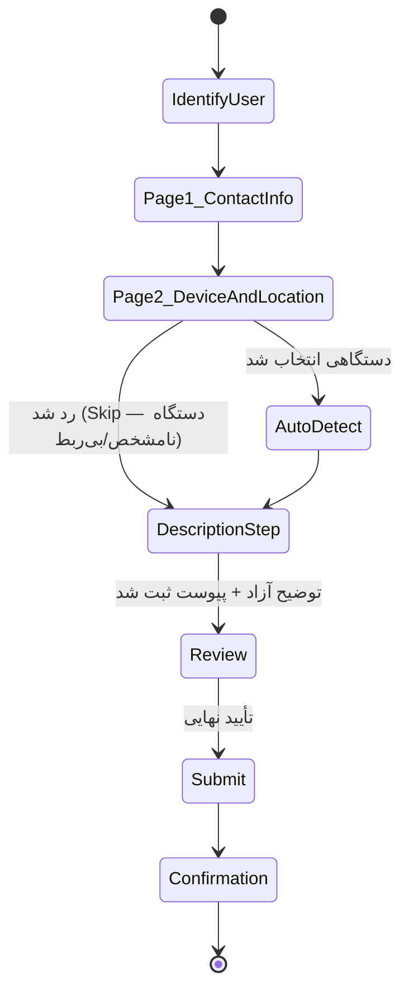
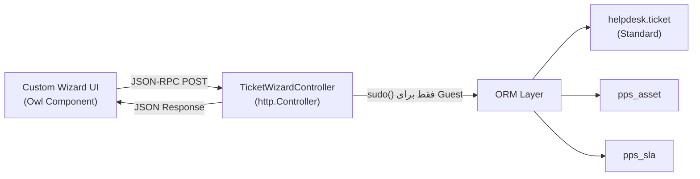

# DOC-038 — `pps_ticket_wizard` Technical Design

**Status:** LOCKED
**Phase:** Phase 3 (Custom Experience Layer)
**Document Type:** Technical Design
**Traces to:** DOC-006 (Business Rules), DOC-025 §4.A, DOC-036 §4, DOC-039 §6

---

# 1. Objective

طراحی فنی ماژول `pps_ticket_wizard` — تنها راه ثبت Ticket برای Guest و Customer.
این سند، قوانین کسب‌وکار DOC-006 را به یک معماری فنی قابل پیاده‌سازی تبدیل می‌کند، بدون استفاده از فرم استاندارد Helpdesk یا هر OCA Portal Template (طبق DOC-036 §4).

---

# 2. Module Boundaries

```
pps_ticket_wizard/
├── __manifest__.py
├── controllers/
│   └── ticket_wizard_controller.py     # HTTP endpoints (JSON-RPC)
├── models/
│   └── ticket_wizard_helper.py         # منطق کمکی روی helpdesk.ticket (بدون تغییر ساختار Core)
├── static/src/
│   ├── js/                             # Owl Components (اختصاصی)
│   ├── scss/                           # از pps_theme import می‌شود، فایل جدا برای رنگ ندارد
│   └── xml/                            # Templates (نه Website Builder Snippet)
└── security/
    └── ir.model.access.csv             # دسترسی Guest/Portal به Endpointها
```

**وابستگی‌ها:** `helpdesk`, `portal`, `pps_asset`, `pps_contract`, `pps_sla`, `pps_theme`
**عدم وابستگی عمدی:** هیچ ماژول OCA UI/Portal، هیچ `website` Snippet.

---

# 3. Wizard State Machine

**⚠️ اصلاحیه (۲۷ تیر ۱۴۰۵ — لغو تصمیم قبلی DOC-039 §6.3):** Step «انتخاب نوع درخواست» **حذف شد**. دلیل: تست واقعی UI نشان داد از مشتری خواستن این‌که از قبل درخواستش را دسته‌بندی کند (دستگاه/IT/آموزش) اشتباه است — مشتری معمولاً نمی‌داند دقیقاً درخواستش در کدام دسته می‌گنجد، و حتی ممکن است تشخیصش اشتباه باشد. **اصل درست:** مشتری فقط باید بگوید *چه کمکی نیاز دارد* (آزاد، متنی)؛ دسته‌بندی (Team/نوع) کار تیم داخلی (Service Manager) است، بعد از خواندن توضیح، نه پیش‌شرط ثبت تیکت. **مهم‌ترین چیز، ثبت‌شدن تیکت است.**

به‌جای «Page 2 فقط برای نوع سرویس دستگاه»، Page 2 (انتخاب دستگاه) اکنون **همیشه اختیاری** است — مستقل از هر دسته‌بندی، صرفاً چون مشتری ممکن است بداند درخواستش به کدام دستگاه مربوط است یا نداند.



**دسته‌بندی داخلی (بعد از ثبت، نه قبل):** Service Manager بعد از خواندن توضیح آزاد مشتری، Team مناسب (سرویس دستگاه / IT / آموزش) را روی Ticket تنظیم می‌کند — این یک اقدام Backend است، نه بخشی از تجربه مشتری.

هر گذار (Transition) دقیقاً منطبق بر یک قانون کسب‌وکار در DOC-006 است — Wizard هیچ مرحله اضافه‌ای نسبت به مستندات تأییدشده اضافه نمی‌کند.

---

# 4. Step-by-Step Field Spec

## Step 1 — Identify User
| فیلد | منبع | یادداشت |
|---|---|---|
| Session/Login State | Odoo `request.env.user` | تعیین Guest vs Customer |

## Page 1 — Contact Info

**تصمیم نهایی (۲۷ تیر ۱۴۰۵):**
- **Guest:** فرم قابل‌ویرایش — Contact Person Name, Company Name, Phone Number (هر سه الزامی).
- **Customer (لاگین‌کرده):** **بدون فرم** — فقط نمایش **غیرقابل‌ویرایش** (Read-only) مقادیر موجود در `res.partner` (نه Input). چون این اطلاعات از قبل توی دیتابیس هست، نیازی به گرفتن دوباره از کاربر نیست؛ فقط برای اطمینان نمایش داده می‌شود.

| فیلد | نوع | الزامی (Guest) | نگاشت Odoo |
|---|---|---|---|
| Contact Person Name | Text | ✅ | `res.partner.name` |
| Company Name | Text | ✅ | `res.partner.parent_id.name` (Customer) / تکست آزاد (Guest) |
| Phone Number | Text | ✅ | `res.partner.mobile` یا `res.partner.phone` (Fallback اگر mobile خالی بود) |

> فیلدهای Email و City از طراحی حذف شدند (طبق تصمیم ساده‌سازی این نشست) — فقط سه فیلد بالا لازم است.

## Page 2 — Device Selection

**تصمیم نهایی:** بر خلاف نسخه قبلی (اختیاری برای همه)، اکنون:
- **Customer:** یک Dropdown از **تمام Assetهای مشتری، فارغ از وضعیت Contract** (چه دارای قرارداد باشند چه نه) — به محض انتخاب، SLA و آدرس محل دستگاه به‌صورت لحظه‌ای (AJAX) نمایش داده می‌شود.
- **Guest:** چون دستگاهی در سیستم ثبت نشده، فرم دستی «مشخصات نصبی دستگاه» را پر می‌کند؛ SLA نمایشی همیشه سطح **Free/Fallback** است (طبق DOC-039 §10.1).

| فیلد | نوع | الزامی | نگاشت Odoo | یادداشت |
|---|---|---|---|---|
| Select Device | Dropdown | ✅ (Customer) | `pps.asset` (فیلتر `partner_id`، بدون فیلتر Contract) | فقط Customer |
| Device Brand / Model / Serial | Text آزاد | ✅ برند/مدل، ❌ سریال | — | فقط Guest، ورودی دستی |
| Device Location Address | Text | ✅ | — | فقط Guest، آدرس آزاد |
| نمایش لحظه‌ای: Location, SLA, Remote/Onsite Response | Read-only (AJAX) | — | از `pps.asset.contract_id.pps_sla_id` یا Fallback | فقط Customer، بعد از انتخاب دستگاه |

**Serial Number Disambiguation (Customer):** فقط اگر بیش از یک Asset مشابه وجود داشته باشد نمایش داده می‌شود (DOC-006 «Kodak RIP SN:...»). طبق قانون طلایی *Never ask if the system already knows*، اگر فقط یک Asset مطابقت داشته باشد، انتخاب به‌صورت خودکار انجام می‌شود.

**اگر Page 2 رد شد (Skip):** این صفحه کاملاً حذف می‌شود؛ در صورت نیاز، اشاره به دستگاه/نرم‌افزار مرتبط در همان فیلد توضیحات (Step بعد) به‌صورت متن آزاد ذکر می‌شود — بدون فیلد ساختاریافته اضافه در v1.

## Step 3 — Auto Detect (Read-only، فقط اگر دستگاهی در Page 2 انتخاب شده باشد)
داده‌های زیر از Asset/Device انتخاب‌شده در Page 2 استخراج و به‌صورت Read-only نمایش داده می‌شوند:
- Customer, Site, Contract, SLA/Service Policy, Warranty, Previous Service History

منبع: متد کمکی `_get_asset_context(asset_id)` در `ticket_wizard_helper.py` که به مدل‌های `pps_contract`, `pps_sla` Join می‌زند.

اگر Page 2 رد شده باشد، این Step هم Skip می‌شود؛ SLA طبق قانون Fallback در DOC-039 §10.1 محاسبه می‌شود (سطح قرارداد مشتری در صورت وجود، وگرنه پایین‌ترین سطح).

## Step 4 — Description & Attachment
| فیلد | نوع | الزامی |
|---|---|---|
| Issue Description | Textarea | ✅ |
| Attachment | Image Upload (چندتایی) | ❌ |

**تصمیم نهایی روی Attachment:** هر فرمت تصویری با هر سطح فشرده‌سازی/کیفیتی پذیرفته می‌شود (JPEG، PNG، WebP، HEIC و غیره) — بدون محدودیت یا تبدیل اجباری سمت کلاینت. اعتبارسنجی فقط بر مبنای MIME Type عمومی `image/*` انجام می‌شود؛ فشرده‌سازی/بهینه‌سازی (در صورت نیاز آینده برای کاهش حجم Storage) به‌صورت غیرمسدودکننده (Async) در بک‌اند قابل انجام است، نه به‌عنوان پیش‌شرط ثبت.

> طبق DOC-006، سیستم از مشتری عیب‌یابی فنی نمی‌خواهد — فقط توضیح آزاد نیاز و مشکل، به‌همراه تصویر اختیاری.

## Step 5 — Review & SLA Preview
نمایش خلاصه غیرقابل‌ویرایش (شامل Page 1، Page 2 و Description) + پیش‌نمایش SLA محاسبه‌شده (Read-only، از `pps_sla`) — مطابق اصل «SLA Calculation» در DOC-025 §4.A.

## Step 6 — Confirmation

پیام‌های خروجی طبق DOC-006 (سه حالت) + عناصر تکمیلی زیر:

### همه حالت‌ها (Guest / Customer)
| عنصر | توضیح |
|---|---|
| کد رهگیری (Tracking Code) | شناسه یکتا و کوتاه (نه ID داخلی دیتابیس) — نمایش برجسته، قابل کپی |
| پیام تشکر | متن کوتاه و گرم، مطابق زبان طراحی DOC-018 §8 (Minimal, Modern) |
| خلاصه SLA | زمان پاسخگویی/رسیدگی مورد انتظار — از همان پیش‌نمایش Step 5 |

### فقط Guest — عناصر اضافه
| عنصر | توضیح |
|---|---|
| پیشنهاد ساخت حساب کاربری | CTA برجسته: «برای پیگیری آنلاین وضعیت، حساب بسازید» |
| هشدار عدم امکان پیگیری آنلاین | تصریح می‌شود که بدون حساب کاربری، پیگیری وضعیت تیکت از طریق پورتال ممکن نیست و فقط با کد رهگیری (تلفنی/حضوری) قابل استعلام است |

> کد رهگیری برای Guest **جایگزین** دسترسی پورتال است، نه معادل آن — این تفاوت باید در UI کاملاً شفاف بیان شود تا انتظار اشتباه ایجاد نشود.

---

# 5. Guest Duplicate-Submission Prevention (پنجره ۴۵ روزه)

## 5.1 هدف

جلوگیری از ثبت تیکت تکراری توسط یک Guest برای همان درخواست، بدون نیاز به احراز هویت کامل یا CRM Lead.

## 5.2 مکانیزم

پس از ثبت موفق تیکت توسط Guest، **۱ یا ۲ فیلد شناسایی‌کننده** (مثلاً ترکیب `Mobile` + `Serial Number`، یا در نبود Serial، `Mobile` + `Device Brand/Model`) به‌همراه Timestamp در یک جدول سبک (`pps.guest.submission.lock`) ذخیره می‌شود.

```
Key   = hash(Mobile + Serial/Device)
TTL   = 45 روز
Value = تاریخ آخرین ثبت + Tracking Code مرتبط
```

## 5.3 رفتار در ثبت بعدی

اگر Guestای با همان Key در بازه ۴۵ روزه دوباره اقدام به ثبت کند:

- سیستم اجازه ثبت Ticket جدید نمی‌دهد.
- پیام روشن نمایش داده می‌شود: «برای همین درخواست قبلاً یک تیکت با کد `XXXXXX` ثبت شده است.»
- کد رهگیری قبلی مجدداً به کاربر نمایش داده می‌شود (بازیابی، نه ثبت مجدد).

## 5.4 محدودیت‌های عمدی (Scope)

- این مکانیزم **جایگزین احراز هویت یا CRM Lead نیست** — صرفاً جلوگیری از ثبت تکراری (Spam/Duplicate) در بازه کوتاه‌مدت است.
- بعد از انقضای ۴۵ روز، Guest می‌تواند دوباره برای همان دستگاه تیکت ثبت کند (فرض بر این است که مشکل قبلی یا حل‌شده یا نیاز به پیگیری تازه دارد).
- این قفل مانع مراجعه Guest به روش‌های دیگر (تماس تلفنی و غیره) نمی‌شود؛ فقط مسیر Wizard آنلاین را محدود می‌کند.

## 5.5 Odoo Mapping

| جزء | پیاده‌سازی |
|---|---|
| ذخیره‌سازی | مدل سبک اختصاصی `pps.guest.submission.lock` (نه توسعه روی `res.partner` یا `helpdesk.ticket`) |
| پاک‌سازی خودکار | Scheduled Action (Cron) روزانه برای حذف رکوردهای منقضی‌شده |
| بدون ارتباط با CRM | این مدل کاملاً مستقل از Lead/Opportunity است (طبق تصمیم این بخش، Lead ساخته نمی‌شود) |

---

# 5. Backend Flow (Controller → ORM)



- کنترلر هیچ View استاندارد Odoo برنمی‌گرداند — فقط JSON.
- برای Guest از `sudo()` محدود و کنترل‌شده استفاده می‌شود (فقط برای Create روی `helpdesk.ticket` و `res.partner`، نه دسترسی عمومی).
- برای Customer از Session Portal استاندارد استفاده می‌شود (بدون sudo).

---

# 6. Non-Goals (صراحتاً خارج از Scope)

- ❌ تغییر ساختار مدل `helpdesk.ticket` (فقط استفاده، طبق DOC-025 §5)
- ❌ استفاده از `portal.mixin` Templates پیش‌فرض برای نمایش فرم
- ❌ استفاده از هیچ OCA Helpdesk Portal Module
- ❌ منطق تشخیص فنی/عیب‌یابی سمت مشتری

---

# 7. Resolved Questions

1. **Attachment:** حل شد — هر فرمت تصویری با هر کمپرسی پذیرفته می‌شود (بخش ۴، Step 4).
2. **CRM Lead برای Guest ناشناخته:** حل شد — Lead ساخته نمی‌شود (طبق DOC-039 §10، تصمیم پروژه سادگی v1 است). به‌جای آن، مکانیزم سبک «جلوگیری از ثبت تکراری Guest» (بخش ۵) برای کنترل درخواست‌های تکراری کافی است.
3. **نوع درخواست (IT/آموزش):** ~~حل شد — Step جدید «Request Type» اضافه شد طبق DOC-039 §6.3~~ **⚠️ لغو شد (۲۷ تیر ۱۴۰۵، بخش ۳)** — تست واقعی UI نشان داد دسته‌بندی پیش از ثبت اشتباه است؛ مشتری هیچ دسته‌بندی انتخاب نمی‌کند، فقط آزادانه توضیح می‌دهد. دسته‌بندی (Team) بعداً توسط Service Manager انجام می‌شود.

---

# 8. وضعیت پیاده‌سازی (به‌روزرسانی حین کدنویسی، ۲۷ تیر ۱۴۰۵)

## 8.1 تصمیم فنی — Controller + QWeb به‌جای Owl Component

**تصمیم:** برخلاف فرض اولیه (Owl Component، DOC-036 §4.2)، نسخه v1 ویزارد با **Controller پایتون + QWeb Template رندرشده سمت سرور** ساخته می‌شود، نه Owl Component تک‌صفحه‌ای.

**دلیل:** طی توسعه‌ی ماژول‌های قبلی (`pps_asset` و بقیه)، لایه‌ی JS/Widget مدرن Odoo 19 (OWL2) دو بار منبع مشکل واقعی بود (DateTimePicker، Chatter — DOC-049 §9). با توجه به محدودیت‌های محیط توسعه (بدون دسترسی مستقیم به ابزار Debug مرورگر)، مسیر Controller+QWeb پایدارتر و سریع‌تر قابل تحویل تشخیص داده شد.

**Trade-off پذیرفته‌شده:** هر مرحله یک Route/صفحه‌ی جداست (Reload بین مراحل)، نه تجربه‌ی بدون-Reload یک SPA. طراحی بصری (`pps_theme`) و منطق چندمرحله‌ای کسب‌وکاری دست‌نخورده می‌ماند.

## 8.2 مسیرها (Routes) پیاده‌سازی‌شده

| Route | نقش |
|---|---|
| `/support/new` | نمایش مستقیم Page 1 (Contact Info) — بدون هیچ Step دسته‌بندی پیشین |
| `/support/new/contact/save` | ذخیره Contact Info، رفتن به Page 2 |

بقیه Route ها (Device/Location، Description، Review، Confirmation) در تکرارهای بعدی اضافه می‌شوند.

## 8.3 نکته فنی — Session State

داده‌ی هر مرحله در `request.session['pps_wizard']` (Session سمت سرور) نگه‌داری می‌شود، نه در URL یا LocalStorage — چون مرورگر Reload می‌شود بین مراحل (طبق ۸.۱).

## 8.4 اصلاح باگ (حین تست) — دسترسی مستقیم به فیلد `partner.mobile`

**یافته:** دسترسی مستقیم به فیلدهای `res.partner` (مثل `mobile`) داخل QWeb Template باعث خطای `AttributeError` شد (فیلد در این پیکربندی موجود نبود). **راه‌حل:** پیش‌بارگذاری مقادیر (`prefill`) همیشه در **Controller پایتون** با `getattr(partner, 'field', None)` محتاطانه آماده و به Template پاس داده می‌شود — هرگز دسترسی مستقیم به فیلدهای مدل داخل QWeb.

---

# DOC-038 — LOCKED ✅ (با اصلاحیه‌های ۲۷ تیر ۱۴۰۵ — بخش‌های ۳ و ۸)
