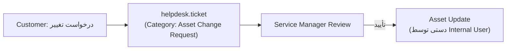
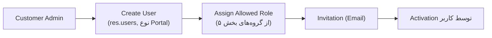

# DOC-042 — `pps_portal` Technical Design

**Status:** LOCKED
**Phase:** Phase 3 (Custom Experience Layer)
**Document Type:** Technical Design
**Traces to:** DOC-018, DOC-026, DOC-036 §4-5, DOC-038, DOC-041

---

# 1. Objective

طراحی فنی پورتال مشتری — تنها راهی که مشتری وضعیت سرویس، دارایی، قرارداد و صورت‌حساب خودش رو می‌بینه. طبق DOC-026 §2: «Customer Visibility + Controlled Self Service − No Master Data Modification».

---

# 2. Module Boundaries

```
pps_portal/
├── controllers/
│   └── portal_controller.py     # Route: /my/... (زیرمجموعه portal استاندارد Odoo)
├── models/
│   └── portal_helper.py         # Query Helperها روی pps_asset/pps_contract/helpdesk.ticket
├── static/src/
│   ├── js/                      # Owl Components (Dashboard, Lists)
│   ├── scss/                    # از pps_theme import می‌شود
│   └── xml/
└── security/
    ├── security_groups.xml      # 4 نقش مشتری (بخش ۵)
    └── ir.rule.xml               # Record Rules (بخش ۵)
```

**وابستگی‌ها:** `portal` (استاندارد Odoo)، `helpdesk_mgmt`، `pps_asset`، `pps_contract`، `pps_sla`، `pps_theme`
**بدون وابستگی عمدی:** هیچ Portal Template پیش‌فرض OCA/Enterprise (طبق DOC-036).

---

# 3. صفحات (طبق Scope دقیق DOC-026 §3)

| صفحه | Route پیشنهادی | منبع داده |
|---|---|---|
| Dashboard | `/my/dashboard` | Aggregate از همه مدل‌های زیر |
| Assets | `/my/assets` | `pps.asset` (فیلتر `partner_id`) |
| Asset History | `/my/assets/<id>` | `pps.asset.ticket_ids` (DOC-041 §4.1) |
| Tickets | `/my/tickets` | `helpdesk.ticket` |
| Service Reports | `/my/service-reports` | مدل جدید `pps.service.report` (طبق DOC-013 — هنوز طراحی فنی نشده، بخش ۸) |
| Contracts | `/my/contracts` | `contract.contract` از طریق `pps.package` |
| Digital Signature Center | `/my/signatures` | بخش ۷ (نیاز به بررسی OCA) |
| Customer User Management | `/my/users` | `res.users` + `res.partner` (Child Contacts) |
| Finance Section | `/my/finance` | `account.move` (فقط برای نقش Accounting Contact) |

## 3.1 Dashboard — عناصر (طبق DOC-026 §4)

Open Tickets، Active Assets، Active Contracts، Pending Actions، Pending Signatures، Recent Services — همه Read-only، محاسبه از طریق Query روی مدل‌های بالا (بدون مدل جدید برای Dashboard خودش).

---

# 4. Asset Permission Rule (پیاده‌سازی مستقیم DOC-026 §7)

| عمل | Customer |
|---|---|
| View Asset | ✅ |
| View History | ✅ |
| Edit Asset (Serial, Model, Contract) | ❌ (سطح Record Rule: `write` غیرفعال برای گروه Portal) |

## 4.1 Asset Change Request (DOC-026 §8)

به‌جای فرم ویرایش مستقیم، یک دکمه «درخواست تغییر» که یک `helpdesk.ticket` جدید با Category «Asset Change Request» می‌سازد (بازاستفاده از همان زیرساخت Ticket، **بدون مدل جدید** — سازگار با اصل سادگی v1):



---

# 5. Customer Roles → Odoo Security Groups

طبق DOC-026 §14، چهار نقش با دسترسی متفاوت. پیاده‌سازی از طریق **Security Groups + Record Rules**، نه فیلد Boolean:

| نقش (Business) | گروه Odoo (`pps_portal.group_*`) | دسترسی |
|---|---|---|
| Customer Admin | `group_portal_admin` | مدیریت کاربران مشتری (بخش ۹) + مشاهده کامل سرویس |
| Technical Contact | `group_portal_technical` | Assets, Tickets, Service Reports |
| Accounting Contact | `group_portal_accounting` | Finance Section, Invoice, Payment Status |
| Normal User | `group_portal_basic` (پیش‌فرض) | فقط Create/Track Ticket |

## 5.1 Record Rule پایه (همه گروه‌ها)

```python
domain = "[('partner_id', 'child_of', user.partner_id.commercial_partner_id.id)]"
```

هر مشتری فقط داده‌های مربوط به **شرکت خودش** (نه فقط خودش) را می‌بیند — چون Customer Admin باید بتواند داده‌ی همه کاربران شرکت خودش را ببیند (Multi-Contact per Company، طبق DOC-018).

## 5.2 محدودیت‌های Customer Admin (DOC-026 §15)

| عمل | مجاز؟ |
|---|---|
| ایجاد User جدید در شرکت خودش | ✅ |
| تخصیص نقش‌های مجاز مشتری (بخش ۵ همین جدول) | ✅ |
| ایجاد Internal Role (Service Manager/Technician) | ❌ — از طریق عدم دسترسی به `res.groups` داخلی |
| تغییر Permission داخلی | ❌ |

---

# 6. Ticket Tracking — فیلدهای نمایشی (DOC-026 §9.2)

**نمایش داده می‌شود:** Ticket Number, Status, SLA Expected Response, Latest Update
**نمایش داده نمی‌شود:** Internal Notes, Technician Hint, Credit Status, Internal Priority Logic

**پیاده‌سازی:** یک `فیلد Read Model` جدا (Controller Serializer سفارشی) که فقط فیلدهای مجاز را از `helpdesk.ticket` استخراج می‌کند — نه نمایش مستقیم رکورد کامل، حتی با فیلتر View (برای جلوگیری از نشت داده از طریق API/JSON مستقیم).

---

# 7. Digital Signature Center — نیاز به بررسی OCA (Open Item)

اپ رسمی Odoo برای امضای دیجیتال (**Sign**) هم **Enterprise-only** است (مشابه الگوی Helpdesk/Field Service که در DOC-040 کشف شد).

**اقدام لازم (طبق الگوی DOC-040):** بررسی معادل OCA — کاندید احتمالی: `OCA/e-commerce` ندارد، ولی repo مرتبط ممکن است `sign` معادل نداشته باشد و نیاز به راه‌حل جایگزین باشد (مثلاً تأیید ساده با Checkbox + Timestamp + IP Log به‌جای امضای گرافیکی واقعی، برای v1).

> **این آیتم باید در یک بررسی جدا (مشابه DOC-040) قبل از قفل نهایی این سند بررسی شود — به Watchlist اضافه شد.**

---

# 8. Service Report — مدل هنوز طراحی نشده

`pps.service.report` طبق DOC-013 «Custom Model, New» است اما هنوز طراحی فنی (فیلدها) ندارد — DOC-007 فقط سطح تحلیل کسب‌وکار دارد. **این باید در یک سند فنی جدا (DOC-04X بعدی) طراحی شود** — پورتال فقط مصرف‌کننده این مدل است، نه سازنده آن.

---

# 9. Customer User Management Flow (DOC-026 §13)



بدون نیاز به ماژول جدید — از مکانیزم استاندارد Portal User Invite در Odoo Core استفاده می‌شود.

---

# 10. Resolved (بررسی سریع انجام شد)

## 10.1 امضای دیجیتال

یک ماژول OCA پیدا شد: **`sign_oca`** — امکان ساخت درخواست امضا داخل Odoo Community با OWL، بدون وابستگی به اپ Enterprise Sign.

**تصمیم:** `sign_oca` به Watchlist DOC-040 §3.3 اضافه می‌شود؛ قبل از استفاده باید سازگاری با Branch 19.0 روی Staging تأیید شود (طبق همان الگوی بررسی DOC-040). اگر سازگار نبود، جایگزین ساده v1: تأیید با Checkbox + Timestamp + IP Log (بدون امضای گرافیکی واقعی).

## 10.2 Finance Section

**تصمیم:** فقط یک **خلاصه سبک** (Summary) — وضعیت فاکتور (پرداخت‌شده/معوق) و مبلغ — نه جزئیات کامل حسابداری (`account.move` کامل Expose نمی‌شود). سازگار با اصل «سادگی v1».

---

# DOC-042 — LOCKED ✅
(با یک Follow-up لازم: تأیید نهایی `sign_oca` روی Staging در فاز ۰، مشابه DOC-040)
