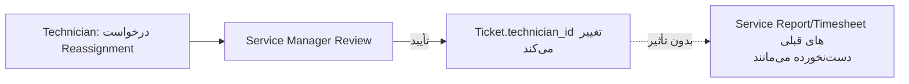

# DOC-043 — `pps_service_report` Technical Design

**Status:** LOCKED
**Phase:** Phase 2 (Custom Data Model Extensions)
**Document Type:** Technical Design
**Traces to:** DOC-007, DOC-008, DOC-013, DOC-024, DOC-041, DOC-042 §8

---

# 1. Objective

طراحی فنی `pps.service.report` — سند نتیجه هر تلاش برای ارائه سرویس (حضوری یا غیرحضوری)، طبق DOC-007. این مدل توسط پورتال مصرف می‌شود (DOC-042 §3) اما اینجا ساخته می‌شود.

---

# 2. مدل — Custom (طبق DOC-013، بدون معادل مستقیم Odoo)

## 2.1 فیلدها

| فیلد | نوع | الزامی | منبع |
|---|---|---|---|
| `ticket_id` | Many2one → `helpdesk.ticket` | ✅ | DOC-007 BR-007 |
| `asset_id` | Many2one → `pps.asset` | ✅ | DOC-007 BR-006 |
| `fsm_order_id` | Many2one → `fsm.order` | ❌ (فقط برای Onsite Visit) | اصلاح — پیوند به OCA Field Service (DOC-040 §8.3)، DOC-007 هیچ ذکری از FSM نداشت چون قبل از کشف محیط واقعی نوشته شده بود |
| `technician_id` | Many2one → `res.users` | ✅ | DOC-007 BR-003 |
| `service_type` | Selection: Remote Support / Phone Support / Online Support / Onsite Visit / Workshop Repair / Inspection / Preventive Maintenance / Installation / Training / Other | ✅ | DOC-007 §Service Type |
| `report_date` | Date | ✅ | DOC-007 §Required Fields |
| `start_time` / `end_time` | Datetime | ✅ | همان |
| `working_duration` | Float (Computed از start/end) | — | همان |
| `problem_description` | Text | ✅ | DOC-007 §Technical Report |
| `root_cause` | Text | ❌ | همان |
| `diagnostic_process` | Text | ❌ | همان |
| `actions_performed` | Text | ✅ | همان |
| `recommendations` | Text | ❌ | همان |
| `next_action` | Text | ❌ | همان |
| `parts_used_ids` | One2many → `pps.service.report.part` (خط جزء، بخش ۳) | ❌ | DOC-007 §Parts، ارجاع به DOC-008 |
| `timesheet_ids` | One2many → `account.analytic.line` | ❌ | DOC-007 BR-005 + DOC-013 (Native Model) |
| `attachment_ids` | Many2many → `ir.attachment` | ❌ | DOC-007 §Attachments |
| `customer_confirmed` | Boolean | ❌ | DOC-007 §Customer Confirmation |
| `customer_confirmation_name` | Char | ❌ | همان |
| `customer_confirmation_date` | Datetime | ❌ | همان |
| `customer_signature` | Binary (از `sign_oca` در صورت تأیید نهایی، وگرنه ساده Checkbox+Timestamp+IP طبق DOC-042 §10.1) | ❌ | همان |

## 2.2 خط قطعات مصرفی — `pps.service.report.part`

مدل سبک واسط (نه تکرار DOC-008)؛ فقط ثبت «چه قطعه‌ای در این گزارش استفاده/درخواست شد»:

| فیلد | نوع |
|---|---|
| `service_report_id` | Many2one → `pps.service.report` |
| `product_id` | Many2one → `product.product` |
| `quantity` | Float |
| `status` | Selection: Used / Requested |

> کنترل موجودی، تحویل، بازگشت واقعی قطعه در `stock.*` استاندارد انجام می‌شود (DOC-008) — این مدل فقط لینک گزارشی است، نه موتور انبار.

---

# 3. قوانین کسب‌وکار (پیاده‌سازی مستقیم DOC-007)

| قانون | پیاده‌سازی فنی |
|---|---|
| هر تلاش سرویس یک Report می‌سازد (BR-001) | بدون Constraint خاص — هر بار Technician دکمه «ثبت گزارش» می‌زند رکورد جدید ساخته می‌شود |
| یک Ticket چند Report دارد (BR-002) | `ticket_id` غیر یکتا؛ `helpdesk.ticket` یک `service_report_ids` One2many معکوس می‌گیرد |
| فقط Technician ثبت می‌کند (BR-003) | Record Rule: `create` فقط برای گروه Technician |
| بستن Ticket فقط با Service Manager (BR-004) | این‌جا اعمال نمی‌شود — منطق در `helpdesk.ticket` (DOC-021/024)، `pps.service.report` هیچ فیلد Stage/Close ندارد |
| Timesheet متصل، حتی با تعویض Technician سابقه حفظ می‌شود (BR-005) | `account.analytic.line` رکوردهای قبلی هرگز حذف/بازنویسی نمی‌شوند؛ Reassignment فقط `technician_id` رکورد *جدید* را تغییر می‌دهد |
| عدم تأیید مشتری مانع ثبت نیست | `customer_confirmed` پیش‌فرض `False`، بدون Constraint اجباری روی ثبت گزارش |

---

# 4. Reassignment (DOC-007 §Reassignment)



پیاده‌سازی سبک: یک دکمه در `pps_ticket_wizard`/Backend که یک `mail.activity` یا Ticket Note برای Service Manager می‌سازد — بدون مدل جدید برای درخواست Reassignment (سازگار با اصل سادگی v1).

---

# 5. ارتباط با `pps_portal` (DOC-042 §3, §10)

مشتری فقط نسخه Read-only این فیلدها را می‌بیند: Service Date, Technician, Work Summary (`actions_performed`), Resolution, Used Parts, Attachments, Signature Status — دقیقاً طبق DOC-026 §10. فیلدهای داخلی (`root_cause`, `diagnostic_process`) به مشتری نمایش داده نمی‌شوند.

---

# 6. Module Dependency

```
pps_service_report
  depends: pps_asset, helpdesk_mgmt, fieldservice (اختیاری، فقط برای fsm_order_id), hr_timesheet
```

---

# DOC-043 — LOCKED ✅
