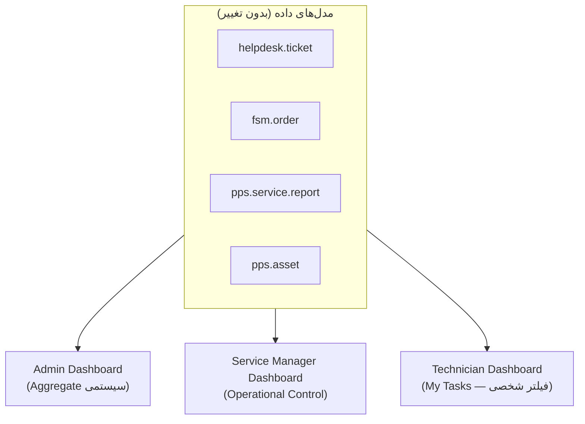

# DOC-045 — `pps_dashboard` Technical Design (Admin / Service Manager / Technician)

**Status:** Draft — Pending Review
**Phase:** Phase 5 (Role-Based Dashboards)
**Document Type:** Technical Design
**Traces to:** DOC-029, DOC-030, DOC-031, DOC-032, DOC-041, DOC-043

---

# 1. Objective

طراحی فنی سه Dashboard داخلی (Admin, Service Manager, Technician) طبق اصل DOC-029 §2: «Dashboard فقط View/Summary/Quick Action است، Workflow اصلی داخلش اجرا نمی‌شود».

---

# 2. Module Boundaries

```
pps_dashboard/
├── controllers/
│   └── dashboard_controller.py   # Endpoint‌های Aggregate جدا برای هر نقش
├── models/
│   └── dashboard_query.py        # Read-only Query Helperها (بدون Write Logic)
├── static/src/
│   ├── js/{admin,manager,technician}/   # Owl Components جدا per نقش
│   └── xml/
└── security/
    └── security_groups.xml       # 3 گروه داخلی (بخش ۳)
```

**اصل کلیدی:** هیچ Action نوشتنی مستقیم در Dashboard نیست — دکمه‌های «Quick Action» فقط **لینک** به صفحه/فرم مربوطه می‌زنند (مثلاً Assign Technician → باز شدن فرم Ticket)، نه Inline Edit در خود Dashboard.

---

# 3. Security Groups (نقش‌های داخلی)

| نقش | گروه Odoo | تمایز از پورتال (DOC-042 §5) |
|---|---|---|
| Admin | `pps_dashboard.group_pps_admin` | داخلی — نه Customer Admin پورتال |
| Service Manager | `pps_dashboard.group_pps_service_manager` | داخلی |
| Technician | `pps_dashboard.group_pps_technician` | داخلی |

> این سه گروه کاملاً مجزا از گروه‌های Portal (`pps_portal.group_portal_*`) هستند — دو دامنه کاملاً مستقل کاربر، طبق DOC-029 §3 («User Domain Separation»).

---

# 4. Admin Dashboard (DOC-030)

## 4.1 محدوده — Admin ≠ Super Admin

طبق DOC-030 §2: Super Admin تنظیمات فنی Odoo (Settings/Apps/Security Config) را مدیریت می‌کند؛ Admin فقط سطح Application.

## 4.2 Widgets و منبع داده

| Widget (DOC-030) | منبع داده |
|---|---|
| تعداد کاربران فعال/غیرفعال | `res.users` (فیلتر `active`) |
| Notification های مهم | `mail.activity` / `bus.bus` |
| عملیات Pending | Aggregate از `helpdesk.ticket` (stage=pending) + سایر مدل‌ها |
| Role & Access Overview | `res.groups` (فقط گروه‌های تعریف‌شده پروژه، نه گروه‌های فنی Odoo) |
| Master Data Management | لینک به `res.partner`, `pps.asset.brand`, `pps.asset.model` |
| Workflow Status (Pending Approval, Missing Assignment, Failed Operation) | Query روی `helpdesk.ticket` + `pps.package` (Contract=False) |

## 4.3 خارج از Scope (DOC-030 §10)

Service KPI **در Admin Dashboard نمایش داده نمی‌شود** — آن مسئولیت Service Manager Dashboard است (تفکیک صریح مسئولیت).

---

# 5. Service Manager Dashboard (DOC-031) — ⭐ پیچیده‌ترین Dashboard

## 5.1 Ticket Management (DOC-031 §4)

| ستون وضعیت | Domain روی `helpdesk.ticket` |
|---|---|
| New / Open / Assigned / Waiting Customer / Waiting Parts / Escalated / Completed | بر اساس `stage_id` — نیاز به تعریف این Stageها در `helpdesk_mgmt` (فاز پیاده‌سازی، نه این سند) |

**Actions (لینک، نه Inline):** Assign Technician، Change Priority، Review Status، Escalate — هرکدام کاربر را به فرم Ticket هدایت می‌کند.

## 5.2 Technician Operations (DOC-031 §5)

| Widget | منبع |
|---|---|
| Active Technicians | `res.users` (گروه Technician) |
| Assigned Tasks / Current Workload | `fsm.order` (تعداد باز per Technician) — طبق اصلاحیه DOC-040/041 |
| Schedule / Availability | `resource.calendar` (استاندارد) |

> **Phase 1:** Skill Management خارج از Scope (طبق DOC-031 §5) — بدون فیلد/مدل اضافه در v1.

## 5.3 Parts Management (DOC-031 §7)

منبع: `pps.service.report.part` (DOC-043 §2.2) Join با `stock.quant` برای وضعیت موجودی.

## 5.4 Customer Credit Status (DOC-031 §9) ⭐

طبق DOC-004 §Customer Credit: فقط **هشدار نمایشی** است، SLA را تغییر نمی‌دهد. منبع: فیلد اعتبار مشتری در `res.partner` (یا ماژول حسابداری استاندارد) — نمایش Read-only، بدون منطق تصمیم‌گیری در Dashboard.

## 5.5 KPI Summary — Phase 1 (DOC-031 §13)

```
Open Tickets | Overdue Tickets | Waiting Parts | Pending Approval | Completed Services
```

همه از یک Query تجمیعی روی `helpdesk.ticket` + `pps.service.report` — بدون مدل KPI جداگانه (طبق اصل سادگی v1). SLA Analytics و Technician Performance Score صراحتاً **Future** هستند (DOC-031 §13).

---

# 6. Technician Dashboard (DOC-032) — Mobile First

## 6.1 اصل طراحی

طبق DOC-032 §3: حداقل کلیک، مناسب موبایل — این یک الزام مستقیم برای `pps_theme` (DOC-044) است: دکمه‌های بزرگ، Layout تک‌ستونه در موبایل.

## 6.2 Widgets و منبع داده

| Widget (DOC-032) | منبع داده |
|---|---|
| My Tasks | `fsm.order` (فیلتر `technician_id = current_user`) |
| Work Order Execution | همان، با جزئیات از `pps.service.report` مرتبط |
| Activity & Time Registration | `account.analytic.line` (از طریق `pps.service.report.timesheet_ids`، DOC-043 §2.1) |
| Attendance | `hr.attendance` (استاندارد Odoo، اگر ماژول `hr_attendance` نصب باشد — بررسی در فاز ۰) |
| Expense Management | `hr.expense` (استاندارد) — طبق DOC-032 §10، با محدودیت مالی (§11) |
| My Parts Management / Part Request | `pps.service.report.part` (DOC-043 §2.2) |
| Service Report | فرم مستقیم ثبت `pps.service.report` (DOC-043) |
| Customer Signature | همان `customer_signature`/`sign_oca` (DOC-043 §2.1، DOC-042 §10.1) |
| Asset History | `pps.asset.ticket_ids` — همان View که در پورتال هم استفاده می‌شود (بازاستفاده Component، نه بازسازی) |
| My Alerts | `mail.activity` تخصیص‌یافته به کاربر |

## 6.3 Assignment Type (DOC-032 §7)

Leader Technician / Supporting Technician — یک فیلد `role_in_task` روی رابطه Technician↔`fsm.order` (نیاز به بررسی ساختار دقیق `fsm.order` OCA برای چند-تکنسینی؛ **Open Item** بخش ۸).

## 6.4 خارج از Scope v1 (DOC-032 §17, §19)

Knowledge Access — صراحتاً Future (هم‌راستا با DOC-039 §10.3 که eLearning را هم به‌طور کامل از v1 حذف کرد).

---

# 7. Cross-Dashboard Principle — یک منبع داده، سه نمای متفاوت

هیچ داده‌ای تکراری ذخیره نمی‌شود؛ هر سه Dashboard از همان مدل‌های DOC-041/043 می‌خوانند، فقط با Domain/Filter متفاوت بر اساس نقش:



---

# 8. Open Items

1. ساختار دقیق چند-تکنسینی (Leader/Supporting) در `fsm.order` — نیاز به بررسی مدل OCA در فاز پیاده‌سازی.
2. آیا `hr_attendance` روی Staging نصب است؟ (برای Widget حضور و غیاب Technician) — باید مشابه الگوی DOC-040 بررسی شود.

---

**Status:** Draft — Pending Review
