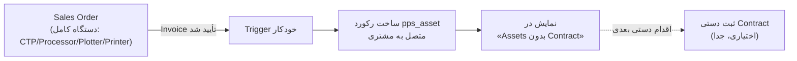

# DOC-039 — Multi-Line Business Model & Sales↔Service Integration Design

**Status:** LOCKED
**Phase:** Phase 3 (Cross-cutting: Sales + Service)
**Document Type:** Business Analysis / Architecture Decision Record
**Traces to / Updates:** DOC-001, DOC-002, DOC-008, DOC-012, DOC-021

---

# 1. Objective

این سند دامنه کسب‌وکار شرکت را از «فقط خدمات پس از فروش» به مدل کامل چندخطی (Multi-Line) گسترش می‌دهد و نحوه‌ی اتصال هر خط کسب‌وکار به هسته Service Management که تا کنون طراحی شده (Asset/Contract/Ticket) را مشخص می‌کند.

## 1.1 خطوط کسب‌وکار (Business Lines)

1. فروش دستگاه‌های پیش از چاپ CTP — نو و استوک
2. قطعات یدکی
3. نرم‌افزارهای مرتبط با صنعت پیش از چاپ (مثل RIP)
4. آموزش اپراتور / نرم‌افزار / سخت‌افزار
5. خدمات IT مرتبط با صنعت چاپ
6. فروش سرویس نصب و خدمات پس از فروش
7. چند برند مختلف (Cross-cutting روی همه خطوط بالا)

**اصل حاکم (طبق تصمیم پروژه):** طراحی کلی از همان ابتدا همه خطوط را در نظر می‌گیرد؛ اما **پیاده‌سازی فازبندی‌شده** باقی می‌ماند (طبق DOC-037، Service Management هسته اولیه است).

---

# 2. Decision Matrix — چه چیزی Asset می‌سازد؟

| خط کسب‌وکار | آیا Asset می‌سازد؟ | توضیح |
|---|---|---|
| دستگاه کامل: CTP / Processor / پلاتر / پرینتر (نو یا استوک) | ✅ بله | خودکار، هنگام ثبت فاکتور فروش |
| قطعه یدکی | ❌ خیر | فقط قلم فروش انبار؛ فقط تگ سازگاری با مدل دستگاه |
| نرم‌افزار (RIP و مشابه) | ❌ خیر | یا قلم فروش معمولی، یا مشخصه/جزء همان Asset دستگاه (نه Asset مستقل) |
| آموزش | ❌ خیر | خدمت است، نه دارایی؛ در قالب Ticket با دسته «آموزش» پیگیری می‌شود |
| خدمات IT | ❌ خیر | خدمت است؛ در قالب Ticket با دسته «IT» پیگیری می‌شود |
| نصب / خدمات پس از فروش | (مرتبط با Asset موجود) | روی Asset ثبت‌شده از فروش دستگاه انجام می‌شود |

---

# 3. Sale → Asset Automation (دستگاه‌های کامل)

## 3.1 جریان

## 3.2 قوانین

- **محرک (Trigger):** تأیید فاکتور فروش (`account.move` state = posted) برای محصولی که دسته‌بندی آن «دستگاه کامل» است — نه هر محصولی.
- **دامنه محصولات محرک:** فقط CTP، Processor، پلاتر، پرینتر. مشخص می‌شود از طریق یک Category/Tag اختصاصی روی `product.template` (مثلاً `is_service_asset = True`)، نه بر اساس نام محصول (برای جلوگیری از خطا).
- **خروجی:** یک رکورد `pps_asset` جدید با وضعیت **«بدون قرارداد» (No Contract)**، متصل به مشتری (`partner_id`) و دستگاه فروخته‌شده (Serial/Model از خط فاکتور یا Lot).
- **Contract:** به‌صورت **عمدی خودکار ساخته نمی‌شود.** ثبت Contract یک اقدام جداگانه و دستی (توسط تیم فروش یا مشتری از طریق پورتال) است — هم‌راستا با اصل «Never force a decision the business hasn't made yet».
- **لیست Asset بدون Contract:** یک View/Dashboard فیلترشده (برای Sales Manager و Service Manager) که این Assetها را نشان می‌دهد تا برای فروش Contract پیگیری شوند (Upsell Opportunity).

## 3.3 محدودیت‌های عمدی (Scope)

- قطعات یدکی و نرم‌افزار از این جریان **صراحتاً مستثنی** هستند (بخش ۲).
- در صورت فروش چند دستگاه در یک فاکتور، به ازای هر دستگاه (هر خط واجد شرایط) یک Asset جدا ساخته می‌شود.

---

# 4. Spare Parts — بدون تغییر ساختاری

فروش قطعه یدکی از همان جریان استاندارد Inventory/Sales استفاده می‌کند (بدون تغییر نسبت به DOC-008).

تنها افزودنی: فیلد **«سازگار با مدل دستگاه»** (Many2many به `pps_asset_model` یا کاتالوگ مدل‌ها) روی `product.template` قطعه — صرفاً برای فیلتر/جستجو در زمان انتخاب قطعه توسط تکنسین یا مشتری؛ **هیچ رابطه ساختاری (مثل Asset) ایجاد نمی‌شود.**

---

# 5. Software — جزء دستگاه یا فروش ساده

## 5.1 تصمیم

نرم‌افزار (مثل RIP) هرگز Asset مستقل نمی‌سازد. دو حالت:

| حالت | رفتار |
|---|---|
| نرم‌افزار همراه دستگاه (Bundle) | به‌عنوان یک مشخصه/جزء (Component) روی همان `pps_asset` دستگاه ثبت می‌شود (مثلاً فیلد یا خط فرعی «نرم‌افزار نصب‌شده: RIP X نسخه Y») |
| نرم‌افزار مستقل (فروش جدا، بدون دستگاه) | یک قلم فروش معمولی Sales Order، بدون هیچ رکورد اضافه در سیستم سرویس |

---

# 6. IT Services & Training — زیرمجموعه‌ی Ticket System

## 6.1 تصمیم

خدمات IT و درخواست‌های آموزش **از همان `helpdesk.ticket` که برای سرویس دستگاه طراحی شده عبور می‌کنند** — نه یک ماژول یا مدل جدا.

## 6.2 تفکیک

تفکیک از طریق **Helpdesk Team + Category**، نه مدل جدا:

| Team (تیم) | دسته‌بندی نمونه | SLA |
|---|---|---|
| Device Service | تعمیر، نگهداری پیشگیرانه | طبق DOC-004 (SLA موجود) |
| IT Services | نصب/پیکربندی نرم‌افزار، شبکه، مشکلات سیستمی | SLA مجزا (قابل تعریف در فاز بعد) |
| Training Requests | درخواست آموزش حضوری/آنلاین | بدون SLA زمان‌پاسخ سخت‌گیرانه (Scheduling-based) |

## 6.3 Ticket Wizard (DOC-038) — تأثیر

**⚠️ لغو شد (۲۷ تیر ۱۴۰۵):** تصمیم زیر (انتخاب پیشینی «نوع خدمت» از مشتری) در تست واقعی UI **رد شد** — مشتری نباید مجبور به دسته‌بندی درخواست خودش قبل از ثبت شود، چون معمولاً نمی‌داند یا ممکن است اشتباه تشخیص دهد. جزئیات کامل و طراحی جایگزین در DOC-038 §3 (نسخه اصلاح‌شده).

~~فرم تیکت اختصاصی (`pps_ticket_wizard`) باید در **Step 1 (شناسایی نوع درخواست)** یک انتخاب «نوع خدمت» اضافه کند: {سرویس دستگاه، IT، آموزش} — که Team مقصد Ticket را تعیین می‌کند.~~

**تصمیم جایگزین:** دسته‌بندی (Team) توسط Service Manager، بعد از ثبت تیکت و خواندن توضیح آزاد مشتری، انجام می‌شود — نه به‌عنوان پیش‌شرط ثبت.

## 6.4 آموزش — دو مدل تحویل

آموزش هم به‌صورت **حضوری/زمان‌بندی‌شده** و هم **آنلاین/eLearning** ارائه می‌شود:

| مدل | رفتار در Ticket |
|---|---|
| حضوری/زمان‌بندی‌شده | Ticket با Category «آموزش-حضوری»؛ نیاز به هماهنگی زمان/محل (شبیه Onsite Visit در DOC-023) |
| آنلاین (eLearning) | Ticket با Category «آموزش-آنلاین»؛ منجر به صدور دسترسی به محتوای آموزشی (جزئیات پلتفرم eLearning در فاز بعد بررسی می‌شود) |

---

# 7. Brand — تگ ساده، بدون ساختار جدا

- برند به‌صورت یک **Tag/Attribute ساده** روی `product.template` (برای فیلتر و جستجو) پیاده می‌شود.
- **بدون** کاتالوگ، قیمت‌گذاری یا تأمین‌کننده جداگانه به ازای هر برند در سطح سیستم.
- تصمیمات قیمت‌گذاری و انتخاب تأمین‌کننده در لحظه فروش، **دستی و توسط Sales Manager و Service Manager** گرفته می‌شود — سیستم این تصمیم را خودکار نمی‌کند.

---

# 8. Asset Model Addendum — دستگاه‌های استوک (به‌روزرسانی DOC-002)

دو فیلد جدید به مدل `pps_asset` اضافه می‌شود (فقط برای دستگاه‌های استوک کاربرد دارد، برای نو خالی/N/A می‌ماند):

| فیلد | نوع | توضیح |
|---|---|---|
| `condition_grade` | Selection (ساختاریافته) | مثلاً: عالی / خوب / متوسط / نیاز به بازبینی |
| `condition_note` | Text (آزاد) | توضیح تکمیلی وضعیت (مثلاً «رنگ بدنه کدر، عملکرد کامل») |
| `warranty_period` | (موجود در DOC-002، اما اکنون صراحتاً) | برای استوک، مدت‌زمان می‌تواند متفاوت (کوتاه‌تر) از دستگاه نو تنظیم شود — همان فیلد قبلی، فقط قانون تفاوت مقدار صراحتاً ثبت شد |

> این بخش باید در بازبینی بعدی مستقیماً در DOC-002 ادغام شود؛ فعلاً به‌عنوان Addendum اینجا ثبت شده تا از دست نرود.

---

# 9. Module Mapping Impact (پیش‌نویس تأثیر روی DOC-012)

| نیاز جدید | ماژول Odoo | یادداشت |
|---|---|---|
| Trigger خودکار Sale→Asset | Custom (`pps_asset` + Automated Action روی `account.move`) | بدون OCA UI، طبق DOC-036 |
| قطعات یدکی + سازگاری مدل | `stock` + فیلد Custom روی `product.template` | بدون ماژول جدید |
| نرم‌افزار به‌عنوان جزء دستگاه | فیلد/رکورد فرعی روی `pps_asset` | بدون ماژول جدید |
| IT/Training Ticket | `helpdesk` (چند Team) + گسترش `pps_ticket_wizard` | بدون ماژول جدید مستقل |
| آموزش آنلاین (eLearning) | نیاز به بررسی — احتمالاً `website_slides` یا معادل، **در فاز ۶ بررسی دقیق می‌شود** | خارج از MVP اولیه |

این جدول باید در بازبینی بعدی مستقیماً در DOC-012 ادغام شود.

---

# 10. Resolved Decisions (به‌روزرسانی سریع)

## 10.1 SLA برای IT و آموزش

**تصمیم:** بدون SLA جدا. یک مدل SLA واحد برای همه‌ی خدمات (دستگاه، IT، آموزش). تفاوت فقط بر اساس **سطح قرارداد** است:

- مشتری با Contract → سطح SLA طبق پکیج/قرارداد (DOC-004, DOC-019)
- مشتری بدون Contract → **پایین‌ترین سطح SLA** به‌صورت پیش‌فرض (Fallback Tier)

هیچ نوع خدمت (Device/IT/Training) موتور SLA جدا نمی‌خواهد.

## 10.2 کلاس‌های آموزشی حضوری

**تصمیم:** بدون تقویم/ظرفیت سیستمی در v1. ثبت Ticket با دسته «آموزش-حضوری» صرفاً **شروع‌کننده یک فرآیند دستی** است: افراد مسئول (تیم فروش/آموزش) به‌صورت آفلاین زمان‌بندی، هزینه اولیه و هزینه پایانی را هماهنگ و در همان Ticket (Log/Note) ثبت می‌کنند. هیچ ماژول Calendar/Booking اضافه نمی‌شود.

## 10.3 آموزش آنلاین (eLearning)

**تصمیم:** ماژول eLearning **کاملاً از v1 و از تصمیم‌گیری فعلی حذف شد.** حتی محتوای ضبط‌شده هم فعلاً نیاز نیست. بازبینی این موضوع به آینده (خارج از Roadmap فعلی) موکول می‌شود؛ در DOC-037 نیازی به فاز جدید برای این مورد نیست.

## 10.4 سازگاری قطعه با مدل دستگاه

**تصمیم:** یک **کاتالوگ ساده قطعات + رابطه سازگاری با برند/مدل** (نه لیست آزاد متنی، نه کاتالوگ کامل و پیچیده). دلیل: قطعات زیادی بین چند برند/مدل مشترک هستند؛ رابطه ساختاریافته از تکرار داده و اشتباه در انتخاب قطعه توسط تکنسین جلوگیری می‌کند.

**پیاده‌سازی سبک:** فیلد Many2many روی `product.template` قطعه → تگ‌های برند/مدل سازگار (همان تگ‌های ساده بخش ۷، نه یک مدل جدید سنگین).

## 10.5 تأثیر روی Roadmap (DOC-037)

**تصمیم:** هیچ فاز جدیدی به Roadmap اضافه نمی‌شود. همه‌ی تصمیمات بالا در فازهای موجود جا می‌گیرند:

| تصمیم | فاز موجود | تغییر لازم |
|---|---|---|
| SLA واحد با Fallback | فاز ۲ (`pps_sla`) | یک قانون Fallback ساده، نه موتور جدا |
| Training Ticket دستی | فاز ۳ (`pps_ticket_wizard`) | فقط یک Category جدید، بدون منطق اضافه |
| eLearning | — | حذف شد، تأثیری روی Roadmap ندارد |
| کاتالوگ سازگاری قطعه | فاز ۲ (مدل داده) | یک فیلد Many2many روی محصول قطعه |

**نتیجه‌گیری صریح:** این تصمیمات پیچیدگی به v1 اضافه نمی‌کنند — دقیقاً هدف «سریع و ساده به دیپلوی v1 برسیم» حفظ شد.

---

# DOC-039 — LOCKED ✅
