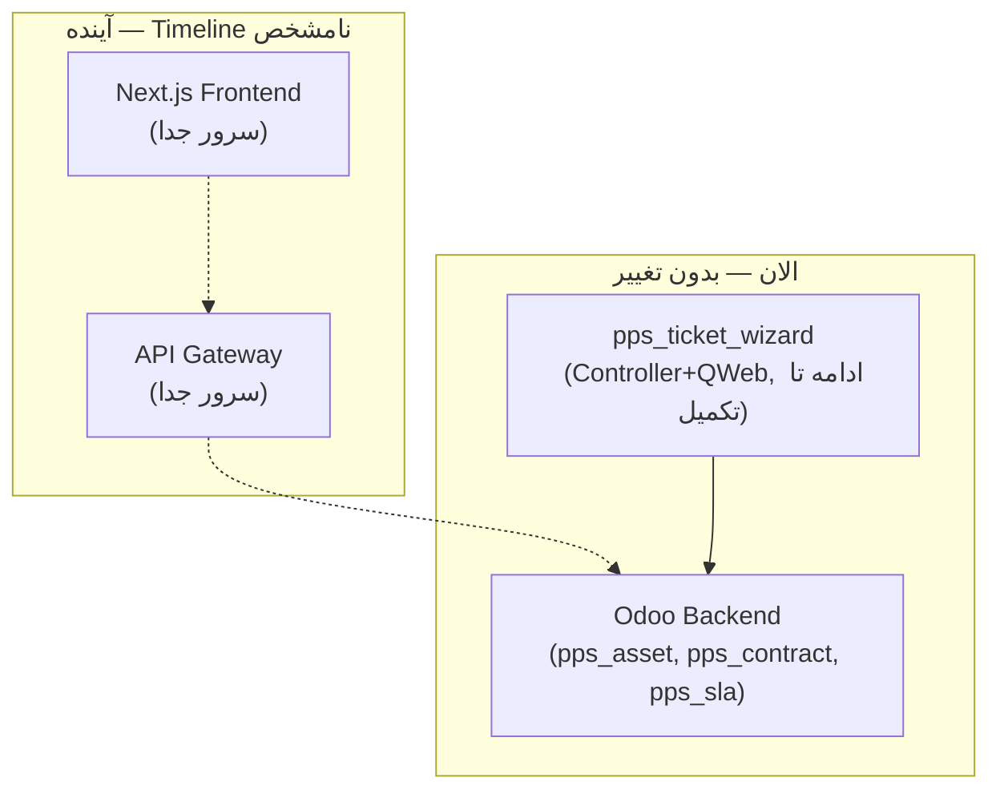

# DOC-050 — Ecosystem Architecture: Decoupled Frontend & Odoo Backend

**Status:** LOCKED
**Phase:** Cross-Phase (تصمیم چارچوب بالادستی، تأثیرگذار بر فازهای آینده)
**Document Type:** Architecture Decision Record
**Traces to / Reconciles:** DOC-036, DOC-038, DOC-042, دو سند خارجی «Vina Ecosystem — Document 00 / Document 01»

---

# 1. Objective

مستندسازی یک تصمیم معماری بالادستی که خارج از این پروژه (در سطح هلدینگ/گروه) مطرح شد و مستقیماً روی جهت‌گیری آینده‌ی لایه‌ی تجربه‌ی مشتری این پروژه اثر می‌گذارد. این سند رابطه‌ی این تصمیم را با مستندات قفل‌شده‌ی قبلی (DOC-036، DOC-038، DOC-042) روشن می‌کند.

---

# 2. زمینه — دو سند ورودی

دو سند خارجی («Document 00 — High Level System Architecture» و «Document 01 — Communication Architecture Blueprint») یک معماری دو-دنیایی برای اکوسیستم بزرگ‌تر (گروه هلدینگ، نه فقط این پروژه) پیشنهاد داده‌اند:

```
CUSTOMER WORLD:  Customer → Cloudflare → HAProxy → Next.js Frontend → API Gateway → Odoo
EMPLOYEE WORLD:  Employee → Odoo Web Client → Odoo   (بدون تغییر نسبت به وضعیت فعلی)
```

**نکته‌ی نام‌گذاری:** پروژه با نام «Vina» جلو نمی‌رود؛ نام برند نهایی جدا تعیین می‌شود. این سند به همین دلیل عمداً از نام تجاری پرهیز می‌کند و فقط به لایه‌های فنی (Frontend / API Gateway / Odoo) اشاره دارد.

---

# 3. تصمیم — رابطه با این پروژه

## 3.1 تأیید شد

| بخش | وضعیت |
|---|---|
| این پروژه (خدمات پیش از چاپ) بخشی از یک اکوسیستم/گروه بزرگ‌تر است | ✅ تأیید شد |
| Backend (Odoo) — شامل تمام ماژول‌های `pps_*` که تا الان ساخته شده — بدون وقفه ادامه می‌یابد | ✅ تأیید شد |
| در آینده، یک سرور دوم مجزا برای Frontend/API Gateway (احتمالاً Next.js) راه‌اندازی می‌شود | ✅ تأیید شد (Timeline نامشخص، نه فوری) |
| مدیریت Frontend و Backend به‌صورت موازی، در صورت نیاز | ✅ تأیید شد |

## 3.2 رد شد / موکول به آینده

- تعویض فوری معماری v1 فعلی (Odoo-served Website) با Next.js — **رد شد برای الان**.
- توقف توسعه‌ی `pps_ticket_wizard` — **رد شد**؛ توسعه ادامه می‌یابد (بخش ۴).

---

# 4. تأثیر روی `pps_ticket_wizard` (DOC-038)

## 4.1 تصمیم

توسعه‌ی `pps_ticket_wizard` به همان شکل فعلی (Controller + QWeb، سرویس‌دهی مستقیم از Odoo Website در `/support/new`) **ادامه می‌یابد تا تکمیل**. دلایل:

1. کار تقریباً تمام است (۲ صفحه از ۶ صفحه باقی مانده)؛ متوقف کردن آن دور ریختن کار انجام‌شده بدون جایگزین آماده است.
2. ساخت یک API «برای آینده» بدون وجود یک Frontend واقعی (Next.js) برای تست End-to-End، ریسک بیشتری از فایده دارد — نمی‌توان کورکورانه یک Contract طراحی کرد که تست نشود.
3. منطق اصلی کسب‌وکار (ساخت Ticket، محاسبه SLA) با یک تغییر کوچک (افزودن Route از نوع `jsonrpc` کنار `http`) در آینده قابل Expose شدن به API Gateway است — نیازی به بازنویسی کامل نیست.

## 4.2 الزام فنی جدید — جداسازی منطق از لایه نمایش

برای آماده‌سازی مسیر آینده (بدون کند کردن مسیر فعلی)، منطق «ساخت Ticket» باید در یک لایه‌ی مستقل (مثلاً `models/ticket_wizard_service.py`) نوشته شود — نه مستقیم داخل متدهای Controller HTTP. Controller فعلی (`type='http'`) فقط این Service را صدا می‌زند و خروجی را QWeb رندر می‌کند. در آینده، یک Controller دوم (`type='jsonrpc'`) می‌تواند همان Service را صدا بزند و خروجی JSON بدهد — بدون تکرار منطق.

**این الزام برای بقیه‌ی توسعه‌ی `pps_ticket_wizard` (Page 3، Page 4، ثبت نهایی Ticket) از همین نقطه به بعد اعمال می‌شود.**

## 4.3 دامنه‌ی دقیق این الزام (سؤال متداول — پاسخ صریح)

**آیا `pps_asset`, `pps_contract`, `pps_sla` هم نیاز به تغییر لایه دارند؟ — خیر.**

این سه ماژول از ابتدا **فقط Model** هستند (کلاس‌های خالص ORM، بدون هیچ Controller/HTTP/Renderی) — یعنی از روز اول همان جداسازی لایه‌ای که DOC-050 برای آینده لازم دارد را داشته‌اند، بدون نیاز به تصمیم آگاهانه‌ی جداگانه. یک API Gateway آینده، دقیقاً همان‌طور که Odoo Backend یا `pps_ticket_wizard` امروز به این مدل‌ها دسترسی دارند (`env['pps.asset'].search(...)`)، بدون هیچ تغییری می‌تواند به آن‌ها دسترسی داشته باشد.

**قاعده‌ی کلی برای تشخیص نیاز به Refactor:** فقط ماژول‌هایی که **Controller** دارند (کد متصل به `@http.route`) مشمول این الزام‌اند — چون فقط آنجا امکان قاطی‌شدن منطق کسب‌وکار با منطق نمایش (Render) وجود دارد. مدل‌های خالص داده هرگز این ریسک را ندارند.

| ماژول | دارای Controller؟ | نیاز به Service Layer جدا؟ |
|---|---|---|
| `pps_asset`, `pps_contract`, `pps_sla` | ❌ خیر (فقط Model) | ❌ خیر — از قبل جداست |
| `pps_ticket_wizard` | ✅ بله | ✅ بله (بخش ۴.۲) |
| `pps_portal`, `pps_dashboard` (فازهای بعدی) | ✅ بله (طبق طراحی) | ✅ بله، از همان ابتدای کدنویسی |

---

# 5. Not Applicable به این پروژه (فعلاً)

این بخش‌ها از اسناد ورودی مستقیماً به این پروژه (لایه Backend/Odoo) ربطی ندارند و مسئولیت تیم/فاز جداگانه‌ای هستند، نه این مستندات:

- انتخاب فریم‌ورک Frontend (Next.js/TypeScript/Tailwind)
- پیکربندی HAProxy، Cloudflare، DNS
- طراحی دقیق API Gateway (Authentication، Rate Limit، Data Formatting)
- ساختار پوشه‌بندی Next.js

اگر/وقتی این فاز واقعاً شروع شود، مستندات جداگانه‌ای (خارج از شماره‌گذاری DOC-0XX این پروژه، یا در یک پوشه مجزا) لازم است — پیشنهاد می‌شود از همان الگوی مستندسازی این پروژه (Business Analysis → Architecture → Technical Design) پیروی شود.

---

# 6. جمع‌بندی



**نتیجه صریح:** هیچ آسیبی به کار انجام‌شده وارد نشد. مسیر فعلی معتبر می‌ماند؛ فقط یک الزام سبک (جداسازی Service Layer) برای سازگاری آینده اضافه شد.

---

**Status:** LOCKED
