# DOC-037 — Implementation Roadmap

**Status:** LOCKED
**Phase:** Cross-Phase (Consolidates DOC-011, DOC-012, DOC-014, DOC-025, DOC-036)
**Document Type:** Delivery Plan

---

# 1. Objective

نقشه راه اجرایی پروژه بر اساس تصمیمات معماری ثبت‌شده در اسناد ۰۰۱ تا ۰۳۶، به‌ترتیب فازهای قابل تحویل (Deliverable-based)، نه فقط زمان‌محور.

اصل حاکم بر توالی فازها:

```
Odoo Standard Core  →  Data Model Extensions  →  Custom Experience Layer  →  Website Theme  →  Dashboards  →  Ops/Notification  →  Hardening
```

---

# 2. Roadmap Diagram

```mermaid
gantt
    title نقشه راه پیاده‌سازی (Deliverable-based)
    dateFormat  X
    axisFormat %s

    section فاز ۰ - زیرساخت
    نصب Odoo + OCA پایه (Data Only)      :p0, 0, 2

    section فاز ۱ - هسته استاندارد
    پیکربندی Helpdesk/Task/Stock/Accounting/CRM :p1, after p0, 3

    section فاز ۲ - مدل داده اختصاصی
    pps_asset / pps_contract / pps_package / pps_sla :p2, after p1, 3

    section فاز ۳ - لایه تجربه کاربری
    pps_ticket_wizard (Custom Ticket Form)  :p3, after p2, 3
    pps_portal (Customer Portal)            :p3b, after p2, 3

    section فاز ۴ - Theme و وب‌سایت
    pps_theme (Design System + Website)     :p4, after p3, 2

    section فاز ۵ - Dashboardها
    pps_dashboard (Admin/Manager/Technician) :p5, after p4, 3

    section فاز ۶ - عملیات تکمیلی
    pps_notification / Knowledge / Expense   :p6, after p5, 2

    section فاز ۷ - سخت‌سازی و استقرار
    UAT / Security / Deployment / Go-Live    :p7, after p6, 2

    section فاز ۸ - Post-MVP
    Marketplace (pps_theme)                  :p8, after p7, 3
```



> واحد بازه‌ها نسبی است (هفته)؛ برای برنامه‌ریزی دقیق باید با تیم اجرا Calibrate شود.

---

# 3. Phase Breakdown

## Phase 0 — Infrastructure

**هدف:** آماده‌سازی محیط طبق DOC-014 و DOC-015.

- نصب Odoo روی Ubuntu Server (Self-Hosted، بدون Docker طبق DOC-018)
- ساختار Repository طبق DOC-014 (`odoo/`, `oca/`, `addons/`, `themes/`, `config/`, `docker/`, `docs/`, `scripts/`, `backups/`)
- نصب فقط OCA Modules لایه داده (طبق DOC-036 §3.1) — بدون هیچ OCA UI/Theme

**خروجی:** محیط Dev/Staging آماده، Repository مرتب.

---

## Phase 1 — Odoo Standard Core

**هدف:** فعال‌سازی و پیکربندی ماژول‌های استاندارد بدون هیچ توسعه سفارشی (طبق DOC-012, DOC-025).

- Contacts, CRM, Helpdesk, Project/Task, Inventory (Stock), Accounting, Timesheet
- تعریف Groups/Access Rights/Record Rules پایه (طبق DOC-025 §7)

**خروجی:** فرآیندهای Core در Backend Odoo کار می‌کنند (هنوز بدون UI اختصاصی).

---

## Phase 2 — Custom Data Model Extensions

**هدف:** ساخت ماژول‌های داده‌ای اختصاصی (بدون UI عمومی) طبق DOC-002, DOC-013, DOC-020.

ماژول‌ها:
- `pps_asset` — دارایی/تجهیزات مشتری
- `pps_package` — پکیج سرویس
- `pps_contract` — قرارداد و اتصال به Subscription/Sales
- `pps_sla` — منطق SLA اختصاصی روی Helpdesk

**خروجی:** مدل داده کامل پروژه در Backend Odoo موجود و قابل تست از طریق Backend استاندارد.

---

## Phase 3 — Custom Experience Layer (اولویت بالا طبق DOC-025 و DOC-036)

**هدف:** ساخت سه‌ بخش Custom اصلی.

- `pps_ticket_wizard` — فرم چندمرحله‌ای ثبت/پیگیری تیکت (DOC-036 §4)
- `pps_portal` — Customer Portal اختصاصی (Dashboard, Ticket, Contract, Service Report)
- کنترلرهای HTTP اختصاصی بین UI و ORM (بدون Website Builder Form)

**خروجی:** مشتری می‌تواند بدون دیدن هیچ فرم استاندارد Odoo، تیکت ثبت و پیگیری کند.

---

## Phase 4 — Website Theme & Design System

**هدف:** پیاده‌سازی `pps_theme` طبق DOC-036 §5.

- Design Tokens (رنگ، تایپوگرافی، Spacing)
- کامپوننت‌های پایه UI (Button, Card, Stepper, Badge)
- صفحات عمومی (Home, About, Contact, Login/Register) با تم اختصاصی
- RTL Native + پشتیبانی فارسی/انگلیسی (DOC-018 §21)

**خروجی:** وب‌سایت و پورتال ظاهر یکدست، مینیمال و مدرن دارند.

---

## Phase 5 — Role-Based Dashboards

**هدف:** ساخت `pps_dashboard` طبق DOC-029 تا DOC-032.

- Admin Dashboard
- Service Manager Dashboard
- Technician Dashboard

**خروجی:** هر نقش فقط داده و اکشن مرتبط با خود را می‌بیند (DOC-025 §9).

---

## Phase 6 — Notification, Knowledge & Expense

**هدف:** تکمیل قابلیت‌های عملیاتی جانبی.

- `pps_notification` — مرکز اطلاع‌رسانی (DOC-034)، فاز اول فقط Portal/In-App (DOC-018 §24)
- Knowledge Management برای تکنسین (DOC-035)
- Technician Expense Management (DOC-033)

**خروجی:** سیستم از نظر عملیاتی کامل است.

---

## Phase 7 — Hardening & Go-Live

**هدف:** آماده‌سازی نهایی برای بهره‌برداری.

- UAT با نقش‌های واقعی (Customer, Technician, Manager, Admin)
- بازبینی امنیتی Access Rights/Record Rules
- Backup/Restore طبق `backups/` در DOC-014
- Deployment نهایی و Go-Live

**خروجی:** سیستم در محیط Production فعال است.

---

## Phase 8 — Marketplace (Post-MVP)

**هدف:** افزودن Marketplace (DOC-018 §12) بعد از تثبیت MVP.

**وضعیت:** خارج از MVP اولیه — هم‌راستا با تصمیم DOC-012 (بخش «Excluded From MVP») که Field Service، Planning، Map/GIS، Appointment، Reservation را نیز از فاز اول خارج کرده است.

**دلیل:** هسته اصلی ارزش پروژه، مدیریت سرویس (Ticket → Task → Technician → Closure) است. Marketplace یک قابلیت تکمیلی تجاری است که ریسک/هزینه فاز ۱ را بدون نیاز واقعی MVP افزایش می‌دهد.

- استفاده از همان `pps_theme` (طبق تصمیم بخش ۹.۲ در DOC-036؛ Design System جدا لازم نیست)
- Scope دقیق (Products / Services / Information) در زمان شروع این فاز بازبینی می‌شود

**خروجی:** Marketplace به‌عنوان توسعه فاز دوم، بدون تأثیر بر Timeline و ریسک MVP.

---

# 4. Dependency Notes

- فاز ۳ (Custom Experience Layer) **نمی‌تواند قبل از فاز ۲** شروع شود، چون به مدل داده اختصاصی نیاز دارد.
- فاز ۴ (Theme): **فرض تیم کوچک/متوسط** — بخش سنگین توسعه (کامپوننت‌سازی و یکپارچه‌سازی نهایی) به‌صورت **متوالی بعد از فاز ۳** انجام می‌شود تا تیم توسعه روی یک محور کار کند. تنها بخش سبک و مستقل (تعریف Design Tokens: رنگ/تایپوگرافی/Spacing) می‌تواند از همان ابتدای فاز ۳ توسط طراح UI به‌صورت موازی و بدون وابستگی به Backend آغاز شود.
- فاز ۶ به بخشی از فاز ۵ (Dashboard Notification Widget) وابسته است.
- **Marketplace از MVP خارج است** (بند ۶ را ببینید) و به فاز ۸ (Post-MVP) موکول شده — هم‌راستا با خروج Field Service/Planning از MVP در DOC-012.

---

# 5. Traceability to Existing Docs

| فاز | اسناد مرجع |
|---|---|
| ۰ | DOC-014, DOC-015 |
| ۱ | DOC-012, DOC-025 |
| ۲ | DOC-002, DOC-013, DOC-019, DOC-020, DOC-022 |
| ۳ | DOC-006, DOC-021, DOC-025, DOC-036 |
| ۴ | DOC-016, DOC-017, DOC-018, DOC-036 |
| ۵ | DOC-029, DOC-030, DOC-031, DOC-032 |
| ۶ | DOC-033, DOC-034, DOC-035 |
| ۷ | DOC-009, DOC-015, DOC-025 |
| ۸ | DOC-012 (Excluded From MVP), DOC-018 §12, DOC-036 §9.2 |

---

# 6. Assumptions Made (برای شفافیت)

این دو تصمیم توسط تحلیل‌گر و بر مبنای اسناد موجود اتخاذ شد (قابل بازبینی در صورت تغییر شرایط تیم):

- **اندازه تیم:** فرض بر تیم کوچک/متوسط توسعه است؛ به همین دلیل فاز ۴ عمدتاً متوالی برنامه‌ریزی شده، نه کاملاً موازی.
- **Marketplace:** خارج از MVP و به فاز ۸ (Post-MVP) منتقل شد، هم‌راستا با رویکرد لاغر (Lean) در DOC-012.

---

# DOC-037 — LOCKED ✅
