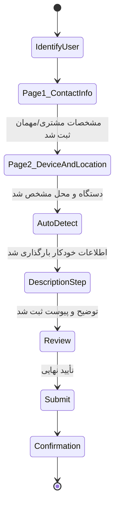
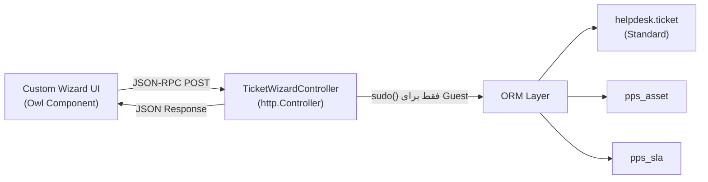

# DOC-038 — `pps_ticket_wizard` Technical Design

**Status:** Draft — Pending Review
**Phase:** Phase 3 (Custom Experience Layer)
**Document Type:** Technical Design
**Traces to:** DOC-006 (Business Rules), DOC-025 §4.A, DOC-036 §4

---

# 1. Objective

طراحی فنی ماژول `pps_ticket_wizard` — تنها راه ثبت Ticket برای Guest و Customer.
این سند، قوانین کسب‌وکار DOC-006 را به یک معماری فنی قابل پیاده‌سازی تبدیل می‌کند، بدون استفاده از فرم استاندارد Helpdesk یا هر OCA Portal Template (طبق DOC-036 §4).

---

# 2. Module Boundaries

```
pps_ticket_wizard/
├── __manifest__.py
├── controllers/
│   └── ticket_wizard_controller.py     # HTTP endpoints (JSON-RPC)
├── models/
│   └── ticket_wizard_helper.py         # منطق کمکی روی helpdesk.ticket (بدون تغییر ساختار Core)
├── static/src/
│   ├── js/                             # Owl Components (اختصاصی)
│   ├── scss/                           # از pps_theme import می‌شود، فایل جدا برای رنگ ندارد
│   └── xml/                            # Templates (نه Website Builder Snippet)
└── security/
    └── ir.model.access.csv             # دسترسی Guest/Portal به Endpointها
```

**وابستگی‌ها:** `helpdesk`, `portal`, `pps_asset`, `pps_contract`, `pps_sla`, `pps_theme`
**عدم وابستگی عمدی:** هیچ ماژول OCA UI/Portal، هیچ `website` Snippet.

---

# 3. Wizard State Machine

بر اساس DOC-006 و تصمیمات تکمیلی (بخش ۴.۱): صفحه اول = مشخصات مشتری/مهمان، صفحه دوم = مشخصات دستگاه + محل قرارگیری آن. این ترتیب برای **هر دو مسیر Guest و Customer یکسان** است؛ تفاوت فقط در این است که برای Customer اطلاعات پیش‌بارگذاری (Pre-filled) می‌شود و برای Guest به‌صورت دستی وارد می‌شود.



هر گذار (Transition) دقیقاً منطبق بر یک قانون کسب‌وکار در DOC-006 است — Wizard هیچ مرحله اضافه‌ای نسبت به مستند تأییدشده اضافه نمی‌کند.

---

# 4. Step-by-Step Field Spec

## Step 1 — Identify User
| فیلد | منبع | یادداشت |
|---|---|---|
| Session/Login State | Odoo `request.env.user` | تعیین Guest vs Customer |

## Page 1 — Contact Info (مشترک برای Guest و Customer)

**Guest:** فیلدها به‌صورت دستی پر می‌شوند.
**Customer:** فیلدها از `res.partner` پیش‌بارگذاری و قابل تأیید/ویرایش هستند (مطابق DOC-006: «هیچ گزینه‌ای پیش‌فرض انتخاب نمی‌شود» برای لیست‌ها، اما اطلاعات تماس شناخته‌شده نمایش داده می‌شود).

| فیلد | نوع | الزامی | نگاشت Odoo |
|---|---|---|---|
| Name | Text | ✅ | `res.partner.name` |
| Company | Text | ❌ | `res.partner.parent_id` / تکست آزاد (Guest) |
| Mobile | Text | ✅ | `res.partner.mobile` |
| Email | Text | ❌ | `res.partner.email` |
| City | Select | ❌ | `res.partner.city_id` |

## Page 2 — Device & Location

**Guest:** فیلدهای دستگاه به‌صورت دستی + یک فیلد آزاد محل قرارگیری دستگاه.
**Customer:** انتخاب Asset از لیست موجود؛ محل قرارگیری از `pps_asset.location` پیش‌بارگذاری می‌شود ولی قابل ویرایش است (دستگاه ممکن است جابه‌جا شده باشد).

| فیلد | نوع | الزامی | نگاشت Odoo | یادداشت |
|---|---|---|---|---|
| Device Brand | Select | ✅ (Guest) | برای Auto-match `maintenance.equipment` | فقط Guest |
| Device Model | Select | ✅ (Guest) | همان | فقط Guest |
| Serial Number | Text | ❌ | `maintenance.equipment.serial_no` | فقط Guest |
| Asset (دستگاه) | Select | ✅ (Customer) | `pps_asset` مرتبط با `partner_id` جاری | فقط Customer |
| Device Location | Text/Select (Site) | ✅ | `pps_asset.location_id` (Customer) یا آدرس آزاد (Guest) | محل نصب/استقرار دستگاه — برای برنامه‌ریزی Onsite Visit ضروری است |

**Serial Number Disambiguation (Customer):** فقط اگر بیش از یک Asset مشابه وجود داشته باشد نمایش داده می‌شود (DOC-006 «Kodak RIP SN:...»). طبق قانون طلایی *Never ask if the system already knows*، اگر فقط یک Asset مطابقت داشته باشد، انتخاب به‌صورت خودکار انجام می‌شود.

## Step 3 — Auto Detect (Read-only، بدون ورودی کاربر)
داده‌های زیر از Asset/Device انتخاب‌شده در Page 2 استخراج و به‌صورت Read-only نمایش داده می‌شوند:
- Customer, Site, Service Package, Contract, SLA/Service Policy, Warranty, Previous Service History

منبع: متد کمکی `_get_asset_context(asset_id)` در `ticket_wizard_helper.py` که به مدل‌های `pps_contract`, `pps_package`, `pps_sla` Join می‌زند.

## Step 4 — Description & Attachment
| فیلد | نوع | الزامی |
|---|---|---|
| Issue Description | Textarea | ✅ |
| Attachment | Image Upload (چندتایی) | ❌ |

**تصمیم نهایی روی Attachment:** هر فرمت تصویری با هر سطح فشرده‌سازی/کیفیتی پذیرفته می‌شود (JPEG، PNG، WebP، HEIC و غیره) — بدون محدودیت یا تبدیل اجباری سمت کلاینت. اعتبارسنجی فقط بر مبنای MIME Type عمومی `image/*` انجام می‌شود؛ فشرده‌سازی/بهینه‌سازی (در صورت نیاز آینده برای کاهش حجم Storage) به‌صورت غیرمسدودکننده (Async) در بک‌اند قابل انجام است، نه به‌عنوان پیش‌شرط ثبت.

> طبق DOC-006، سیستم از مشتری عیب‌یابی فنی نمی‌خواهد — فقط توضیح آزاد نیاز و مشکل، به‌همراه تصویر اختیاری.

## Step 5 — Review & SLA Preview
نمایش خلاصه غیرقابل‌ویرایش (شامل Page 1، Page 2 و Description) + پیش‌نمایش SLA محاسبه‌شده (Read-only، از `pps_sla`) — مطابق اصل «SLA Calculation» در DOC-025 §4.A.

## Step 6 — Confirmation
پیام‌های خروجی دقیقاً طبق DOC-006 (سه حالت: Guest / Customer بدون Contract / Customer دارای Contract).

---

# 5. Backend Flow (Controller → ORM)



- کنترلر هیچ View استاندارد Odoo برنمی‌گرداند — فقط JSON.
- برای Guest از `sudo()` محدود و کنترل‌شده استفاده می‌شود (فقط برای Create روی `helpdesk.ticket` و `res.partner`، نه دسترسی عمومی).
- برای Customer از Session Portal استاندارد استفاده می‌شود (بدون sudo).

---

# 6. Non-Goals (صراحتاً خارج از Scope)

- ❌ تغییر ساختار مدل `helpdesk.ticket` (فقط استفاده، طبق DOC-025 §5)
- ❌ استفاده از `portal.mixin` Templates پیش‌فرض برای نمایش فرم
- ❌ استفاده از هیچ OCA Helpdesk Portal Module
- ❌ منطق تشخیص فنی/عیب‌یابی سمت مشتری

---

# 7. Open Questions

1. ~~آیا Attachment باید محدود به فرمت/حجم خاصی باشد؟~~ **حل شد:** هر فرمت تصویری با هر کمپرسی پذیرفته می‌شود (بخش ۴، Step 4).
2. آیا برای Guest بدون تطبیق Asset (دستگاه ناشناخته)، باید Lead در CRM هم ساخته شود همزمان با Ticket؟ (DOC-018 §15 اشاره به CRM دارد اما این جریان دقیق مشخص نیست.)

---

**Status:** Draft — Pending Review
