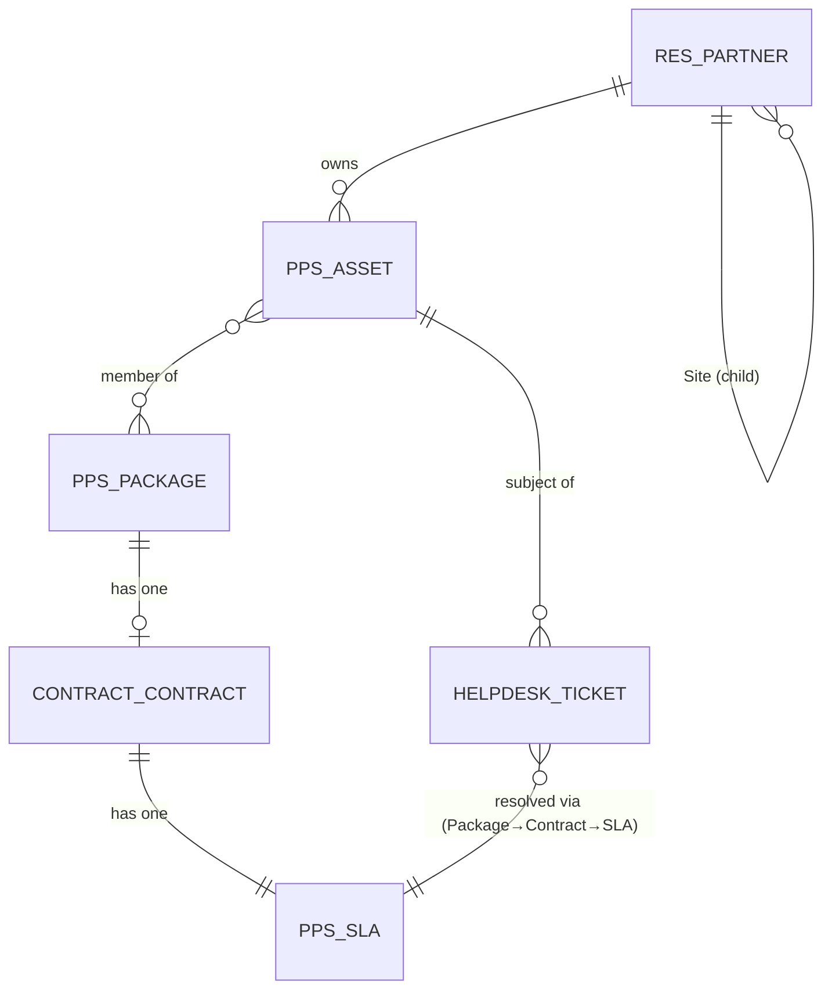
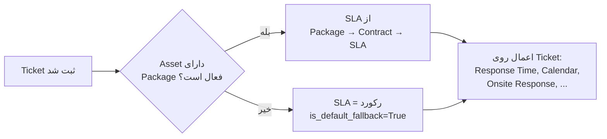

# DOC-041 — Asset / Package / Contract / SLA — Technical Design

**Status:** LOCKED
**Phase:** Phase 2 (Custom Data Model Extensions)
**Document Type:** Technical Design
**Traces to / Corrects:** DOC-002, DOC-004, DOC-013, DOC-019, DOC-022, DOC-039, DOC-040

---

# 1. Objective

طراحی فنی چهار مدل هسته‌ای سرویس (Asset → Package → Contract → SLA) بر اساس تصمیمات کسب‌وکار قفل‌شده (DOC-002, DOC-004, DOC-019) و **اصلاح دو مورد از DOC-013** که با بررسی محیط واقعی (DOC-040) ناسازگار بودند.

---

# 2. اصلاحیه‌های مهم روی DOC-013 (Entity Mapping)

با بررسی محیط واقعی Community Edition (DOC-040) و بازبینی مشترک با شما، **سه ردیف** جدول Entity Mapping در DOC-013 نیاز به اصلاح دارند:

| Entity | نگاشت قبلی (DOC-013 / DOC-002) | نگاشت اصلاح‌شده | دلیل |
|---|---|---|---|
| **Asset** | `maintenance.equipment` (Extension) | **Custom Model (`pps.asset`)** | `maintenance.equipment` برای تجهیزات داخلی شرکت طراحی شده (فیلدهای Employee/Department بی‌ربط) و مدل درخواست داخلی خودش (`maintenance.request`) با `helpdesk.ticket` انتخابی ما تداخل مسیر ایجاد می‌کند. چون فعلاً هیچ دستگاه داخلی مدیریت نمی‌شود (تصمیم صریح پروژه، احتمال بازبینی در v2)، یک مدل سبک کاملاً اختصاصی منطقی‌تر و بدون تداخل است. |
| SLA | `helpdesk.sla` (Extension) | **Custom Model (`pps.sla`)** | `helpdesk.sla` معادل Enterprise است. معادل OCA آن (`helpdesk_mgmt_sla`) فقط SLA ساده سطح-تیم (روز/ساعت) پشتیبانی می‌کند، نه منطق لایه‌بندی‌شده Package/Contract که DOC-004 و DOC-019 نیاز دارند. پس مطابق تصمیم اولیه پروژه (`pps_sla` کاملاً اختصاصی)، ادامه می‌دهیم — این هم‌راستا با چیزی است که در DOC-012/019 هم از قبل پیش‌بینی شده بود. |
| Contract | `sale.subscription / sale.order` (Extension) | **`contract.contract`** (Extension از `OCA/contract`, ماژول `contract` — تأیید Branch 19.0 موجود) | `sale.subscription` (اپ Odoo Subscriptions) Enterprise-only است و در Community در دسترس نیست. DOC-004 خودش هم از ابتدا «OCA Contract» را پیش‌بینی کرده بود — این اصلاحیه فقط DOC-013 را با DOC-004 هماهنگ می‌کند. |

> این سه اصلاحیه در بازبینی بعدی مستقیماً در DOC-013 **و DOC-002** اعمال می‌شوند؛ فعلاً منبع مرجع نگاشت صحیح همین سند (DOC-041) است.
>
> **یادداشت v2:** اگر در آینده نیاز به مدیریت تجهیزات داخلی شرکت (نه دستگاه مشتری) پیش بیاید، آن‌موقع می‌توان جداگانه از `maintenance.equipment` استفاده کرد — کاملاً مجزا از `pps.asset` که برای دستگاه مشتری است. این دو مفهوم عمداً از هم جدا نگه داشته می‌شوند.

---

# 3. Entity Relationship (نهایی)



**نکته مهم (طبق DOC-039 §3):** یک Asset می‌تواند بدون Package/Contract هم وجود داشته باشد («Asset بدون قرارداد») — رابطه Package اختیاری است، نه اجباری.

---

# 4. `pps_asset` — Custom Model (اصلاح‌شده، بدون وابستگی به `maintenance`)

**تصمیم نهایی (بازبینی مشترک):** مدل کاملاً اختصاصی، **نه** Extension روی `maintenance.equipment` — طبق بخش ۲.

## 4.1 فیلدها

| فیلد | نوع | الزامی | منبع تصمیم |
|---|---|---|---|
| `name` | Char (Computed: Brand + Model + Serial) | — | نمایش استاندارد Odoo |
| `pps_serial_number` | Char, **Unique Constraint** | ✅ | DOC-002 BR-001 |
| `pps_brand_id` | Many2one → `pps.asset.brand` (دیکشنری سبک) | ✅ | DOC-002 BR-002 |
| `pps_model_id` | Many2one → `pps.asset.model` (وابسته به Brand) | ✅ | DOC-002 BR-003 |
| `pps_manufacture_date` | Date | ✅ | DOC-002 Required Fields |
| `partner_id` | Many2one → `res.partner` | ✅ | مالک دستگاه (مشتری) — فیلد مستقیم، چون Asset می‌تواند بدون Package باشد (DOC-039 §3) |
| `pps_condition_grade` | Selection: عالی / خوب / متوسط / نیاز به بازبینی | فقط استوک | DOC-039 §8 |
| `pps_condition_note` | Text (آزاد) | ❌ | DOC-039 §8 |
| `pps_warranty_period` | Integer (ماه) | ❌ | DOC-039 §8 — مقدار پیش‌فرض بر اساس نو/استوک متفاوت |
| `pps_is_service_asset` | Boolean (Computed از دسته محصول فروش) | — | DOC-039 §3.2 — مشخص می‌کند این تجهیز از فروش دستگاه کامل ساخته شده |
| `pps_location_id` | Many2one → `res.partner` (Child/Site) یا Text آزاد | ✅ | DOC-038 §4 (Device Location) |
| `pps_package_id` | Many2one → `pps.package` | ❌ (Optional — «بدون قرارداد» مجاز است) | DOC-039 §3، DOC-019 §4 |
| `ticket_ids` | One2many → `helpdesk.ticket` | — | تاریخچه سرویس — **تنها** مسیر تاریخچه (بدون `maintenance.request` موازی) |

## 4.2 قوانین (از DOC-002 مستقیماً پیاده‌سازی می‌شوند)

- `pps_serial_number` باید `sql_constraint` یکتا داشته باشد (BR-001).
- `pps_brand_id` و `pps_model_id` فقط توسط Internal Users قابل ایجاد/ویرایش‌اند (BR-004) — از طریق Record Rule، نه مخفی‌سازی UI.
- Domain فیلتر روی `pps_model_id` بر اساس `pps_brand_id` انتخاب‌شده (BR-003 — وابستگی Model به Brand).
- ثبت Ticket برای هر Asset، صرف‌نظر از داشتن Package/Contract، مجاز است (BR-005) — یعنی هیچ Constraint سطح دیتابیس نباید ثبت Ticket بدون Package را مسدود کند.
- **یک مسیر واحد تاریخچه سرویس:** فقط از طریق `helpdesk.ticket` (`ticket_ids`)؛ هیچ مدل درخواست موازی (مثل `maintenance.request`) در سیستم وجود ندارد.

## 4.3 `pps_asset_model` — دیکشنری برند/مدل

مدل سبک کمکی (نه Product، طبق یادداشت DOC-002 که Brand/Model را «Dictionary» می‌داند، نه کاتالوگ فروش):

```
pps.asset.brand
  - name

pps.asset.model
  - name
  - brand_id (Many2one → pps.asset.brand)
```

> طبق DOC-039 §7، این دیکشنری همان تگ‌های ساده‌ای هستند که برای فیلتر سازگاری قطعات یدکی (بخش ۶) هم بازاستفاده می‌شوند — یک منبع واحد برند/مدل در کل سیستم.

---

# 5. «Package» — بازبینی معماری (اصلاح مهم، ۲۶ تیر ۱۴۰۵)

**تصمیم قبلی این سند:** یک مدل مستقل `pps.package` با چرخه حیات (Draft/Active/Expired) و رکورد جداگانه.

**اصلاح نهایی (طبق توضیح مستقیم کارفرما):** «Package» صرفاً یک **اصطلاح کسب‌وکاری** است برای «مجموعه‌ی Assetهایی که زیر یک قرارداد هستند» — نه یک موجودیت مستقل با هویت خودش. دلایل:

- ترکیب Assetهای زیر یک قرارداد می‌تواند در قرارداد بعدی **تغییر کند** — نگه‌داشتن یک رکورد ثابت برای این ترکیب معنا ندارد و فقط پیچیدگی/نگهداری اضافه ایجاد می‌کند.
- تمام چیزی که واقعاً لازم است: هر `pps.asset` بداند به کدام `contract.contract` وصل است.

## 5.1 طراحی ساده‌شده

**مدل `pps.package` کاملاً حذف شد.** به‌جای آن:

```
pps.asset.contract_id  →  Many2one → contract.contract  (اختیاری)
```

- «Package» یک مفهوم **محاسبه‌شده/نمایشی** است: یعنی «همه‌ی Assetهایی که `contract_id` یکسان دارند» — نه یک رکورد.
- این فیلد در ماژول `pps_contract` (نه `pps_asset`) به `pps.asset` اضافه می‌شود، دقیقاً به همان روشی که در بخش ۴ (Extension الگو) توضیح داده شد.
- تغییر قرارداد یک مشتری = فقط تغییر `contract_id` روی Assetهای مربوطه؛ نیازی به مدیریت وضعیت (Active/Expired) یک رکورد جداگانه نیست.

## 5.2 قوانین (بدون تغییر نسبت به تصمیم اصلی)

- یک Asset **اختیاراً** به یک Contract وصل است (DOC-039 §3 — «Asset بدون قرارداد» مجاز است).
- این رابطه هرگز وارد Inventory Flow، Product Catalog، Marketplace یا فروش عمومی نمی‌شود (DOC-019 §3 — Exclusion صریح، هنوز معتبر).

---

# 6. `pps_contract` — Extension روی `contract.contract` (OCA)

## 6.1 وابستگی ماژول

`contract` (از `OCA/contract`, Branch 19.0 — تأیید‌شده در جستجوی DOC-040) — ماژول پایه Community-سازگار برای قرارداد‌های تکرارشونده.

## 6.2 فیلدهای اضافه‌شده (`_inherit = 'contract.contract'`)

| فیلد | نوع | یادداشت |
|---|---|---|
| `pps_asset_ids` | One2many → `pps.asset` (معکوس `contract_id`، بخش ۵.۱) | نمایش «Package» — همه‌ی Assetهای متصل به این قرارداد؛ صرفاً نمایشی، نه رکورد مستقل |
| `pps_sla_id` | Many2one → `pps.sla` | هر Contract دقیقاً یک SLA (DOC-019 §6) |

## 6.2.1 فیلد اضافه‌شده به `pps.asset` (`_inherit = 'pps.asset'`، طبق بخش ۵.۱)

| فیلد | نوع | یادداشت |
|---|---|---|
| `contract_id` | Many2one → `contract.contract` | اختیاری — Asset می‌تواند بدون Contract باشد (DOC-039 §3) |

## 6.3 خارج از Scope این سند (طبق DOC-004 §Exclusions)

قیمت، شرایط پرداخت، مدت قرارداد و نوع قرارداد — این‌ها از طریق فیلدهای استاندارد خود ماژول `contract` (Recurrence, Invoicing Rules) مدیریت می‌شوند، نیازی به فیلد اضافه در v1 نیست.

---

# 7. `pps_sla` — Custom Model

بر اساس آیتم‌های دقیق DOC-004 §SLA Items — **یک Template**، نه محاسبه پویا.

## 7.1 فیلدها

| فیلد | نوع | مقادیر نمونه | منبع |
|---|---|---|---|
| `name` | Char | Bronze / Silver / Gold / Platinum (فقط عنوان تجاری) | DOC-004 BR-003, BR-004 |
| `remote_response_time` | Selection/Float (ساعت) | ۲ ساعت، ۴ ساعت، ۱ روز کاری، ۲ روز کاری، ۵ روز کاری | DOC-004 §Response |
| `working_calendar_id` | Many2one → `resource.calendar` | 8×5 یا 24×7 | DOC-004 §Working Calendar |
| `remote_support` | Selection: Included / Optional / Not Included | | DOC-004 §Remote Support |
| `onsite_response_time` | Selection/Float | زمان اعزام کارشناس حضوری | DOC-004 §Onsite Service |
| `spare_parts_commitment` | Selection: Included / Chargeable / Best Effort | | DOC-004 §Spare Parts |
| `loan_device_commitment` | Selection: Included / Optional / Not Included | | DOC-004 §Loan Device |
| `preventive_maintenance_frequency` | Selection: None / Monthly / Quarterly / Semi Annual / Annual / Custom | | DOC-004 §Preventive Maintenance |
| `is_default_fallback` | Boolean | فقط یک رکورد `True` — سطح پیش‌فرض برای مشتری بدون Contract (DOC-039 §10.1) | DOC-039 §10.1 |

## 7.2 قوانین محاسبه در زمان Ticket (طبق DOC-004 §Ticket Processing)



- SLA به Ticket **در لحظه ثبت** متصل می‌شود (Snapshot)، نه Live Reference — تا تغییر بعدی SLA روی Ticketهای قبلی اثر نگذارد (اصل ثبات تاریخی، سازگار با DOC-021).
- اعتبار مالی/اعتباری مشتری (DOC-004 §Customer Credit) SLA را تغییر نمی‌دهد — فقط هشدار به Service Manager نمایش داده می‌شود (بدون فیلد جدید در `pps_sla`، منطق در `pps_ticket_wizard`/Controller پیاده می‌شود).

---

# 8. Module Dependency Summary (به‌روزرسانی DOC-012/DOC-040)

```
pps_asset
  depends: base (Standard Odoo) — بدون وابستگی به maintenance

pps_contract  (توسعه روی contract.contract + توسعه روی pps.asset برای فیلد contract_id)
  depends: contract (OCA), pps_asset

pps_sla
  depends: resource (Standard Odoo), pps_contract
```

**تغییر مهم:** `pps_package` به‌عنوان ماژول مستقل **حذف شد** (بخش ۵) — منطقش داخل `pps_contract` ادغام شد.

**افزودنی به Watchlist DOC-040 §3.3:** ماژول `contract` (از `OCA/contract`) باید به لیست نصب فاز ۰ اضافه شود — این یک نیاز اثبات‌شده است، نه احتمالی.

**حذف‌شده از نیازها:** ماژول `maintenance` استاندارد Odoo — دیگر پیش‌نیاز `pps_asset` نیست (طبق تصمیم بخش ۲).

---

# 9. Resolved

سؤال قبلی درباره نصب بودن ماژول `maintenance` **منتفی شد** — چون `pps_asset` دیگر به آن وابسته نیست (بخش ۲ و ۴).

---

# 10. یادداشت پیاده‌سازی (به‌روزرسانی حین کدنویسی `pps_asset`، ۲۶ تیر ۱۴۰۵)

دو تغییر Breaking در Odoo 19 هنگام کدنویسی واقعی کشف شد — **باید از همان ابتدا در `pps_package`, `pps_contract`, `pps_sla` هم رعایت شود**:

1. **Constraint یکتا:** به‌جای `_sql_constraints = [(...)]` (منسوخ)، از Attribute جدید استفاده شود:
   ```python
   _my_constraint_name = models.Constraint('UNIQUE(field)', 'Error message.')
   ```
2. **Chatter:** به‌جای `<div class="oe_chatter"><field name="message_follower_ids"/>...</div>` (دیگر رندر نمی‌شود)، از تگ خودبسته استفاده شود:
   ```xml
   <chatter/>
   ```

جزئیات کامل رویداد در DOC-049 §9 (رویداد شماره ۵).

---

# 11. اصلاحیه معماری — حذف مدل `pps.package` (۲۶ تیر ۱۴۰۵)

**تصمیم جدید (جایگزین بخش ۵):** «Package» یک **اصطلاح** است، نه یک رکورد مستقل. Package یعنی «مجموعه Assetهایی که زیر یک Contract مشترک هستند» — و چون این مجموعه با هر تمدید/تعویض قرارداد می‌تواند تغییر کند، نگه‌داشتن آن به‌عنوان یک رکورد جدا (با چرخه حیات Draft/Active/Expired) پیچیدگی غیرضروری ایجاد می‌کرد.

## 11.1 طراحی جدید (ساده‌شده)

به‌جای مدل `pps.package`، یک رابطه مستقیم:

```
pps.asset.contract_id  (Many2one → contract.contract, اختیاری)
```

«Package» دیگر رکورد نیست — فقط یعنی «همه Assetهایی که `contract_id` یکسان دارند» (یک Query ساده، نه یک مدل).

## 11.2 تأثیر

- ماژول `pps_package` **حذف شد** (Uninstall شد، کد آن نگه‌داشته نمی‌شود).
- بخش ۵ این سند (طراحی `pps_package`) و بخش ۶ (که `pps_contract` را وابسته به `pps_package` می‌دانست) **منسوخ** هستند — `pps_contract` اکنون مستقیماً فیلد `contract_id` را روی `pps.asset` اضافه می‌کند، بدون واسطه.
- مزیت: تغییر قرارداد یک Asset (مثلاً در تمدید سالانه) فقط با تغییر یک فیلد (`contract_id`) انجام می‌شود، بدون نیاز به مدیریت State یک رکورد Package جداگانه.
- Diagram ER (بخش ۳) اصلاح می‌شود: `PPS_ASSET }o--o| CONTRACT_CONTRACT : "has (optional)"` — بدون واسطه `PPS_PACKAGE`.

---

# DOC-041 — LOCKED ✅ (با اصلاحیه بخش ۱۱)

---

# 12. وضعیت پیاده‌سازی و تست (به‌روزرسانی نهایی، ۲۷ تیر ۱۴۰۵)

هر چهار بخش این خانواده روی محیط واقعی (`vina-odoo`) پیاده‌سازی و End-to-End تست شدند:

| ماژول | وضعیت | تست انجام‌شده |
|---|---|---|
| `pps_asset` | ✅ نصب و تست شد | ساخت Brand/Model وابسته، محاسبه خودکار `name`، فیلتر Model بر اساس Brand، قانون Unique روی Serial Number |
| `pps_package` | ❌ **حذف شد** (طبق بخش ۱۱) | — |
| `pps_contract` | ✅ نصب و تست شد | فیلد `contract_id` مستقیم روی `pps.asset` (View Inheritance با `position="after"`) |
| `pps_sla` | ✅ نصب و تست شد | ساخت چند رکورد SLA (`Gold`, `Free`)، فیلد `is_default_fallback`، اتصال به `contract.contract` از طریق `xpath` روی View مرجع ماژول `contract` |

## 12.1 نکات فنی تکمیلی از پیاده‌سازی واقعی

- **View Inheritance بدون خطا:** توسعه‌ی View مرجع OCA (`contract.contract_contract_customer_form_view`) با `xpath` بدون هیچ ناسازگاری انجام شد — یعنی فرض‌های DOC-041 درباره ساختار این ماژول درست بودند.
- **فیلد تاریخ تولید:** به‌صورت غیرالزامی نگه داشته شد (نه Required)؛ محدودیت شناخته‌شده — ویجت تاریخ استاندارد Odoo نمی‌تواند «فقط سال» را بدون روز/ماه بپذیرد (وارد کردن سال تنها باعث خالی شدن فیلد می‌شود، نه خطا). **راه‌حل موقت v1:** کاربر تاریخ کامل با روز/ماه فرضی وارد می‌کند. **بهبود آینده (Backlog):** فیلد جدای `pps_manufacture_year` (Integer) در صورت نیاز واقعی اضافه شود.
- **توسعه‌پذیری `pps.sla`:** مدل به‌گونه‌ای ساده طراحی شده که افزودن فیلدهای جدید در آینده (طبق نیاز کارفرما) بدون تغییر ساختاری ممکن است — فقط افزودن فیلد + `-u pps_sla` از طریق CLI.

## 12.2 الگوهای فنی تثبیت‌شده (برای ماژول‌های بعدی: `pps_ticket_wizard`, `pps_portal`, `pps_dashboard`)

طبق تجربه‌ی این پیاده‌سازی، این الگوها باید در تمام ماژول‌های بعدی رعایت شوند:

1. **Update همیشه از CLI**، نه دکمه Upgrade در UI (طبق DOC-049 رویداد ۵ — دکمه UI گاهی XML جدید را از دیسک نمی‌خواند):
   ```bash
   sudo systemctl stop odoo
   sudo -u odoo /opt/odoo/venv/bin/python3 /opt/odoo/src/odoo/odoo-bin -c /etc/odoo/odoo.conf -d vina-odoo -u <module> --stop-after-init
   sudo systemctl start odoo
   ```
2. `models.Constraint` به‌جای `_sql_constraints` (منسوخ در Odoo 19).
3. `<chatter/>` به‌جای `<div class="oe_chatter">` دستی (دیگر رندر نمی‌شود در Odoo 19).
4. **مالکیت فایل:** بعد از هر `sudo tee`، حتماً `sudo chown -R odoo:odoo <module_path>` — چون فایل‌های ساخته‌شده با `sudo` به‌طور پیش‌فرض مالک `root` می‌گیرند.
5. **بازنویسی کامل View در ماژول‌های Extension، فقط تا حد نیاز:** به‌جای بازنویسی کامل فرم موجود، از `inherit_id` + `xpath`/`position` استفاده شود (مثل الگوی `pps_contract` و اتصال SLA به `contract.contract`).

---

**نتیجه نهایی:** دیتامدل هسته‌ای پروژه (Asset → Contract → SLA) کامل، تست‌شده، و آماده‌ی توسعه‌ی لایه‌ی تجربه کاربری (فاز ۳ Roadmap) است.
