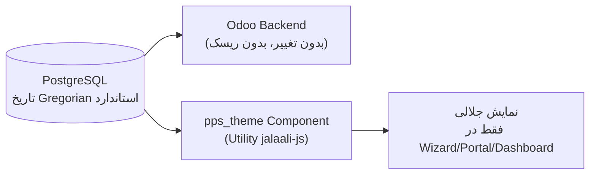

# DOC-049 — Persian Localization Plan (تقویم، فونت، زبان، اسناد استاندارد)

**Status:** LOCKED
**Phase:** Phase 4 (Website Theme) + Phase 0 (زیرساخت)
**Document Type:** Technical Plan
**Traces to / Updates:** DOC-036 §5.3, DOC-040 §3.2, DOC-044 §5

---

# 1. Objective

جمع‌بندی و برنامه‌ریزی کامل چهار بخش بومی‌سازی فارسی: تقویم جلالی، فونت فارسی، زبان رابط کاربری، و اسناد استاندارد فارسی (فاکتور، گزارش سرویس). این سند نتیجه یک رویداد واقعی (بخش ۲) است، نه فرض.

---

# 2. رویداد واقعی — درس گرفته‌شده (Incident Report)

## 2.1 چه اتفاقی افتاد

هنگام نصب ماژول `contract` روی محیط Staging، ماژول third-party `persian_calendar` (که از قبل نصب بود، از منبعی غیر از OCA) باعث خطای JavaScript شد:

```
OwlError: picker.disable is not a function
```

## 2.2 علت ریشه‌ای

`persian_calendar` کامپوننت DateTimePicker استاندارد Odoo رو Override کرده بود، ولی این Override با ساختار OWL2/DateTimePicker در **Odoo 19** ناسازگار بود — دقیقاً همون ریسکی که در DOC-040 §2 پیش‌بینی شده بود («تغییرات Breaking در OWL2 — هر ماژول third-party که این بخش رو لمس کنه باید صریحاً بررسی بشه»).

## 2.3 اقدام

`persian_calendar` **Uninstall شد** (طبق تصمیم مشترک). این سند اکنون جایگزین رسمی آن است.

## 2.4 نتیجه‌گیری کلی (مهم‌تر از خودِ باگ)

این رویداد ثابت کرد که **اصل "بدون وابستگی UI به ماژول‌های third-party/OCA ناشناس"** (DOC-036 §3.2, §5.3) یک احتیاط نظری نبود — یک ریسک واقعی بود که همین امروز رخ داد. تصمیم قبلی (ساخت تقویم جلالی به‌صورت Utility اختصاصی در `pps_theme`) اکنون با اطمینان بیشتری تأیید می‌شود.

---

# 3. تقویم جلالی — راه‌حل نهایی

**بدون تغییر نسبت به DOC-044 §5** — فقط اکنون با اولویت بالاتر:

- کتابخانه JS مستقل و پایدار (`jalaali-js`) — نه Override کامپوننت‌های داخلی Odoo
- پیاده‌سازی به‌صورت **Utility نمایشی** (فقط تبدیل/نمایش تاریخ در Componentهای اختصاصی `pps_theme`)، **نه** جایگزینی Widget تاریخ استاندارد Odoo (Backend همچنان از Gregorian استاندارد Odoo استفاده می‌کند — سازگار با آینده و Upgrade-Safe)
- در فرم‌های Backend استاندارد (که فقط تیم داخلی می‌بیند)، تاریخ میلادی می‌ماند — تبدیل فقط در لایه‌ی نمایش اختصاصی (Wizard, Portal, Dashboard) اتفاق می‌افتد



## 3.1 یافته تکمیلی (تأیید مستقیم روی Staging، ۲۵ تیر ۱۴۰۵)

با فعال‌سازی زبان فارسی (بخش ۵)، مشاهده شد که Odoo فقط **اسم ماه‌های میلادی را با معادل فارسی جایگزین می‌کند** (مثلاً «July» → «مرداد»)، ولی روز/سال همچنان کاملاً میلادی باقی می‌ماند (نتیجه: نمایش گمراه‌کننده‌ای مثل «مرداد ۲۵، ۲۰۲۶»). این **زبان فارسی نیست که تقویم جلالی می‌سازد** — این دو مقوله کاملاً مستقلند:

- **زبان (Language Pack):** فقط ترجمه‌ی متن رابط کاربری — فعال است (بخش ۵)، بدون ریسک.
- **تقویم جلالی واقعی:** نیاز به محاسبه‌ی واقعی تاریخ هجری‌شمسی دارد — این دقیقاً همان کاری است که در همین بخش (۳) برنامه‌ریزی شده و **در فاز توسعه `pps_theme` (نه روی محیط خام Staging) پیاده‌سازی می‌شود**، چون یک کار کدنویسی واقعی است، نه تنظیمات.

**اهمیت پروژه‌ای:** طبق تأکید صریح کارفرما، تقویم جلالی واقعی برای پروژه حیاتی است — این بخش در اولویت فاز ۴ باقی می‌ماند و نباید با نمایش فارسی‌شده‌ی ناقص نام ماه‌ها (که پیش‌فرض و خودکار Odoo است) اشتباه گرفته شود.

---

# 4. فونت فارسی

## 4.1 دو بخش جدا

| بخش | راه‌حل | ریسک |
|---|---|---|
| فونت رابط کاربری (Web) | `Vazirmatn` — مستقیماً در `pps_theme` (DOC-044 §3.1) | پایین — فقط CSS/Web Font، بدون Override کد Odoo |
| فونت گزارش‌های PDF (فاکتور، گزارش سرویس) | ماژول موجود `l10n_ir_fonts` (در `third_party/iran`) | **نیاز به تست مشابه — بخش ۵** |

## 4.2 هشدار — قبل از اعتماد به `l10n_ir_fonts`

چون `persian_calendar` (از همون منبع third_party/iran) ناسازگار از آب درآمد، **نباید فرض کنیم `l10n_ir_fonts` سالم است** — باید جداگانه تست شود (بخش ۵).

---

# 5. زبان فارسی رابط کاربری — راه‌حل کم‌ریسک (استاندارد Odoo)

## 5.1 تصمیم

برخلاف تقویم/فونت، **زبان فارسی رابط کاربری نیازی به ماژول third-party ندارد** — Odoo از پایه از زبان فارسی (`fa_IR`) و ترجمه‌های رسمی جامعه پشتیبانی می‌کند.

## 5.2 روش فعال‌سازی (استاندارد، بدون ریسک)

```
Settings > Translations > Languages > Add a Language > انتخاب "Persian / فارسی" > Load
```

سپس در `Settings > Translations > Languages`، فارسی را به‌عنوان `Default Language` برای کاربران/شرکت تنظیم کنید.

## 5.3 چرا این کم‌ریسک است

این قابلیت **بخشی از هسته Odoo** است (نه OCA، نه third-party) — همون سطحی که در DOC-040 «Core» طبقه‌بندی کردیم، نه Watchlist.

---

# 6. اسناد استاندارد فارسی (فاکتور، گزارش سرویس)

## 6.1 تصمیم — بدون وابستگی به Template آماده

طبق اصل DOC-036 (بدون OCA/Third-party UI)، قالب‌های PDF اسناد (فاکتور، `pps.service.report` طبق DOC-043) **در خود ماژول‌های `pps_*` به‌صورت QWeb اختصاصی طراحی می‌شوند** — نه استفاده از Template آماده خارجی.

## 6.2 چک‌لیست الزامات هر سند فارسی

- [ ] RTL کامل (نه فقط متن، بلکه Layout جدول/عدد) — **الزام تقویت‌شده:** جهت باید صریح در CSS تعریف شود، نه متکی به Bidi خودکار (طبق یافته بخش ۷.۱)
- [ ] اعداد فارسی یا لاتین بر اساس تنظیم شرکت (قابل‌پیکربندی، نه هاردکد)
- [ ] فونت `Vazirmatn` یا معادل تأییدشده از `l10n_ir_fonts` (تأیید شد در بخش ۷)
- [ ] تاریخ جلالی طبق بخش ۳ (فقط در نمایش، نه دیتابیس)
- [ ] **تست اجباری روی خروجی PDF واقعی، نه فقط پیش‌نمایش HTML** (طبق بخش ۷.۱ — این دو می‌توانند نتایج متفاوت بدهند)

---

# 7. اقدام لازم — تست ایزوله `l10n_ir_fonts`

**قبل از استفاده در هر گزارش رسمی**، باید مشابه همین رویداد (بخش ۲) این ماژول جدا تست شود:

- [x] نصب `l10n_ir_fonts` روی Staging — انجام شد (۲۵ تیر ۱۴۰۵)
- [x] تولید یک فاکتور نمونه و بررسی چاپ PDF — انجام شد
- [x] بررسی لاگ خطا — انجام شد
- نتیجه: بخش ۷.۱ زیر

## 7.1 نتیجه تست — یافته دوم (مهم)

**فونت:** مشکلی نداشت — متن فارسی در PDF بدون جعبه خالی/حروف بریده نمایش داده شد.

**🔴 مشکل واقعی کشف‌شده: رندر Bidi (راست‌به‌چپ) در خودِ `wkhtmltopdf`**

مقایسه‌ی مستقیم روی همون فاکتور:

| نسخه | نتیجه |
|---|---|
| پیش‌نمایش HTML (پورتال، توی مرورگر) | ✅ کاملاً درست — RTL، اعداد فارسی، چیدمان سالم |
| PDF واقعی (خروجی `wkhtmltopdf`) | ❌ ترتیب کلمات و اعداد بهم‌ریخته، جدول نامرتب |

**علت ریشه‌ای:** `wkhtmltopdf` بر پایه یک نسخه قدیمی WebKit ساخته شده که پشتیبانی ضعیفی از الگوریتم Unicode Bidi (متن راست‌به‌چپ مخلوط با اعداد/لاتین) دارد — این یک محدودیت شناخته‌شده‌ی خودِ ابزار است، نه خطای پیکربندی ما (فونت/زبان/PATH همگی درست بودند).

**تصمیم نهایی (تقویت‌شده):**

- برای گزارش‌های **استاندارد Backend Odoo** (Invoice پیش‌فرض و مشابه): این محدودیت پذیرفته می‌شود در v1 — این اسناد عمدتاً مصرف داخلی/Admin دارند، نه مشتری نهایی.
- برای اسناد **اختصاصی `pps_*`** (که مشتری واقعی می‌بیند — طبق DOC-042/043): طبق تصمیم قبلی بخش ۶، این‌ها با QWeb اختصاصی ساخته می‌شوند. **الزام فنی جدید** اضافه می‌شود: در CSS این قالب‌ها، به‌جای تکیه بر Bidi خودکار مرورگر/PDF، جهت و چیدمان هر عنصر (بخصوص جدول‌های عدد+متن مخلوط) باید **صریح** تعریف شود (`direction: rtl` در سطح Container + تست مستقیم خروجی PDF برای هر Template جدید، نه فقط پیش‌نمایش HTML).
- **قانون جدید تست:** از این به بعد، هر Template رسمی (فاکتور، گزارش سرویس) باید هم در HTML و هم در PDF نهایی تست بصری شود — پیش‌نمایش HTML به‌تنهایی کافی نیست (چون همین‌جا دیدیم این دو می‌توانند نتایج متفاوتی بدهند).

---

# 8. خلاصه تصمیمات

| حوزه | راه‌حل نهایی | وابستگی external |
|---|---|---|
| تقویم جلالی | Utility اختصاصی در `pps_theme` (`jalaali-js`) | ❌ هیچ |
| فونت وب | `Vazirmatn` در `pps_theme` | ❌ هیچ (فایل فونت مستقیم) |
| فونت PDF | `l10n_ir_fonts` — ✅ تست شد، بدون مشکل | ⚠️ نصب‌شده و تأیید شد |
| رندر Bidi/RTL در PDF | ⚠️ محدودیت شناخته‌شده `wkhtmltopdf` — پذیرفته‌شده برای گزارش‌های Backend، حل‌شده با CSS صریح برای اسناد `pps_*` (بخش ۷.۱) | — |
| زبان UI | زبان رسمی `fa_IR` هسته Odoo — ✅ فعال و تست شد | ✅ استاندارد، بدون ریسک |
| اسناد استاندارد | QWeb اختصاصی در `pps_*` + الزام تست PDF واقعی | ❌ هیچ |

---

# 9. خلاصه رویدادهای فاز ۰ (Incident Log)

| # | رویداد | نتیجه |
|---|---|---|
| ۱ | کرش `persian_calendar` روی Odoo 19 | Uninstall شد، تصمیم Custom Utility تأیید شد (بخش ۲) |
| ۲ | نبود `wkhtmltopdf` روی سرور | نصب نسخه Patched شد |
| ۳ | PATH محدود در `systemd` مانع دیدن `wkhtmltopdf` توسط Odoo شد | اصلاح `Environment=PATH` در `odoo.service` |
| ۴ | رندر Bidi خراب در PDF (اما نه HTML) | محدودیت شناخته‌شده `wkhtmltopdf`؛ راه‌حل در بخش ۷.۱ برای اسناد `pps_*` |

---

**Status:** LOCKED
