# DOC-040 — OCA & Prerequisites Plan

**Status:** LOCKED
**Phase:** Phase 0 (پیش‌نیاز مستقیم Roadmap)
**Document Type:** Technical Plan
**Traces to / Updates:** DOC-014, DOC-015, DOC-036, DOC-037

---

# 1. Objective

مشخص کردن دقیق پیش‌نیازهای فنی فاز ۰ (زیرساخت) — نسخه Odoo، ماژول‌های OCA لازم، و ریسک‌های سازگاری — قبل از شروع نصب واقعی. این سند نتیجه بررسی مستقیم وضعیت فعلی OCA (تیر ۱۴۰۵) است، نه فرض.

---

# 2. Target Version

**تصمیم پروژه:** Odoo 19

| موضوع | وضعیت (بررسی‌شده) |
|---|---|
| نسخه فعلی | Odoo 19 (منتشرشده سپتامبر ۲۰۲۵)، آخرین پچ 19.3 (می ۲۰۲۶) |
| نسخه بعدی | Odoo 20 در سپتامبر ۲۰۲۶ منتشر می‌شود (Odoo Experience 2026) — یعنی حدود ۲ ماه دیگر |
| ریسک مهم | Odoo 19 تغییرات Breaking در ORM، Asset Pipeline، و OWL 2 (جایگزین سیستم Widget قدیمی) دارد — هر ماژول OCA/Third-Party که این بخش‌ها را لمس کند باید صریحاً برای Branch `19.0` بررسی شود، نه فرض گرفته شود |

**توصیه:** ماندن روی Odoo 19 برای v1 درست است (چون سریع‌تر به دیپلوی می‌رسیم)؛ مهاجرت به Odoo 20 موضوع فاز بعدی است، نه الان.

---

# 3. OCA Modules — بررسی‌شده برای Branch 19.0

طبق اصل DOC-036 §3 (OCA فقط لایه داده/منطق بک‌اند، هرگز UI):

## 3.1 بومی‌سازی ایران (`OCA/l10n-iran`, Branch 19.0)

✅ **این Repository برای Odoo 19 آماده است** (بررسی مستقیم انجام شد):

| ماژول | نسخه | کاربرد | لایه |
|---|---|---|---|
| `l10n_ir_account` | 19.0.1.0.0 | ساختار حسابداری ایرانی | ✅ داده/بک‌اند — مجاز طبق DOC-036 |
| `l10n_ir_states` | 19.0.1.0.0 | استان‌ها و شهرهای ایران | ✅ داده/بک‌اند — مجاز طبق DOC-036 |

## 3.2 تقویم جلالی — یافته مهم و تصمیم معماری

**یافته:** ماژول قدیمی `l10n_ir_base` (تبدیل تاریخ به جلالی در UI) در Branch 19.0 این Repository **دیده نمی‌شود** — به‌نظر می‌رسد یا هنوز پورت نشده، یا در این نسخه از OCA حذف شده است.

**تصمیم معماری (هم‌راستا با DOC-036):** این یافته در واقع با اصل پروژه هم‌خوانی دارد، نه در تضاد با آن —
تقویم جلالی دقیقاً یک **مسئله لایه نمایش (UI)** است، نه داده. طبق DOC-036 §5.3 («RTL Native»)، نمایش تاریخ جلالی باید **بخشی از `pps_theme` باشد، نه یک ماژول OCA UI**. یعنی حتی اگر این ماژول OCA وجود داشت، طبق اصل پروژه نباید در صفحات کاربر نهایی استفاده می‌شد.

**اقدام:** تبدیل/نمایش تاریخ جلالی به‌عنوان یک Utility در `pps_theme` (سمت Frontend، با کتابخانه استاندارد JS مثل `jalaali-js`) پیاده می‌شود — نه به‌عنوان وابستگی OCA.

## 3.3 سایر OCA مورد نیاز (بر اساس نیازهای شناخته‌شده پروژه)

این‌ها باید در شروع فاز ۰ برای Branch 19.0 تک‌تک بررسی و Pin شوند (چون Odoo 19 Breaking Change دارد، نباید فرض «همه‌چیز آماده‌ست» گرفت):

| دسته | ماژول‌های احتمالی | چرا لازم است | اولویت بررسی |
|---|---|---|---|
| ابزار سرور | `server-tools` (`queue_job` برای Job پس‌زمینه، مثلاً پردازش Attachment) | برای پردازش Async تصاویر تیکت (DOC-038 §4) | بالا |
| ابزار حسابداری تکمیلی | `account-financial-tools` (`account_financial_report`) | گزارش‌های مالی پیشرفته، در صورت نیاز فاز بعد | پایین (v1 لازم نیست) |
| Contact/Partner | `partner-contact` | فقط در صورت وجود Gap واقعی نسبت به Core | متوسط — نیاز واقعی هنوز شناسایی نشده |
| **Contract** | `contract` (از `OCA/contract`) | موتور قرارداد تکرارشونده — پایه `pps_contract` (**نیاز اثبات‌شده**، DOC-041 §6) | **بالا — باید در فاز ۰ نصب شود** |
| **امضای دیجیتال** | `sign_oca` | جایگزین Community-سازگار برای Odoo Sign (Enterprise) — نیاز پورتال مشتری (DOC-042 §10.1) | متوسط — نیاز تأیید Branch 19.0 |

> **قانون:** هیچ‌کدام از این‌ها «پیش‌فرض نصب» نیستند. هرکدام فقط وقتی اضافه می‌شوند که یک نیاز مشخص در طراحی فنی (مثل DOC-038) به آن‌ها اشاره کند. این جدول یک **Watchlist** است، نه یک لیست نصب قطعی.

---

# 4. Explicit Non-Use (طبق DOC-036)

این دسته‌ها **عمداً از Watchlist خارج شدند** چون همیشه UI/Theme/Portal هستند:

- ❌ هر OCA Theme/Website Module
- ❌ هر OCA Portal Template (شامل Helpdesk Portal)
- ❌ هر OCA Dashboard Widget آماده

---

# 5. Installation Order (فاز ۰)

```mermaid
flowchart TB
    A["Odoo 19 Core (Community)"] --> B["l10n_ir_states"]
    B --> C["l10n_ir_account"]
    C --> D["ماژول‌های Core استاندارد\n(Helpdesk, CRM, Stock, Project)"]
    D --> E["Watchlist OCA\n(فقط در صورت نیاز اثبات‌شده)"]
    E --> F["ماژول‌های اختصاصی pps_*"]
```

**قانون توالی:** هیچ ماژول اختصاصی (`pps_*`) قبل از تثبیت کامل هسته استاندارد + بومی‌سازی نصب نمی‌شود — برای جلوگیری از دیباگ سخت در صورت بروز مشکل.

---

# 6. Compatibility Verification Checklist (قبل از شروع فاز ۰)

- [ ] تأیید نصب تمیز Odoo 19 Community روی سرور Staging
- [ ] نصب `l10n_ir_states` + `l10n_ir_account` و تست ساخت یک فاکتور نمونه
- [ ] در صورت افزودن هر OCA از Watchlist (بخش ۳.۳): تست جداگانه روی Staging قبل از افزودن به مسیر اصلی
- [ ] مستندسازی نسخه دقیق هر ماژول نصب‌شده (طبق هشدار DOC-040 §2 درباره ریسک Upgrade به Odoo 20)

---

# 8. Verified Live Environment (بررسی مستقیم — تیر ۱۴۰۵ / جولای ۲۰۲۶)

محیط واقعی موجود بررسی شد (Settings > Apps + Export `ir.module.module`). نتیجه: **دو انحراف مهم نسبت به فرض‌های اولیه پیدا شد** که DOC-012 را اصلاح می‌کند.

## 8.1 لیست ماژول‌های نصب‌شده (تأییدشده)

| ماژول | منبع | نقش |
|---|---|---|
| `sale_management`, `account`, `crm`, `website`, `stock`, `purchase`, `project`, `hr_expense`, `hr`, `mail`, `contacts`, `calendar`, `project_todo`, `hr_skills` | Odoo Community Core | مطابق کامل با DOC-012 ✅ |
| `helpdesk_mgmt` | **OCA/helpdesk** | جایگزین Community-سازگار برای Helpdesk (که در Odoo فقط Enterprise است) |
| `fieldservice` + `base_territory` | **OCA/field-service** | جایگزین Community-سازگار برای Field Service (که در Odoo هم فقط Enterprise است) |
| `auditlog` | **OCA/server-tools** | لاگ تغییرات، لایه داده — مجاز طبق DOC-036 §3.1 |

## 8.2 اصلاحیه مهم — Helpdesk

**تصمیم قبلی (DOC-012, DOC-025, DOC-038) فرض کرده بود:** `helpdesk.ticket` از ماژول استاندارد/Enterprise Odoo می‌آید.

**واقعیت:** چون نسخه **Community** است (نه Enterprise)، Helpdesk استاندارد Odoo اصلاً در دسترس نیست. ماژول واقعی، `helpdesk_mgmt` از **OCA** است.

**خبر خوب:** نام مدل داده هنوز دقیقاً `helpdesk.ticket` است (تأیید شده از سورس‌کد OCA) — یعنی **تمام طراحی‌های ما (DOC-004 SLA, DOC-006 Wizard, DOC-038 Technical Design) هنوز معتبرند**، فقط باید در نظر بگیریم:

- `helpdesk_mgmt` موتور SLA داخلی ندارد (بر خلاف نسخه Enterprise) — این دقیقاً همان چیزی است که در طراحی `pps_sla` پیش‌بینی کرده بودیم (DOC-019)، پس بدون تغییر برنامه ادامه می‌دهیم.

## 8.3 اصلاحیه مهم — Field Service

**تصمیم قبلی فرض کرده بود:** وظایف تکنسین روی مدل `project.task` مدیریت می‌شود.

**واقعیت:** ماژول نصب‌شده `fieldservice` (از **OCA/field-service**) است که مدل مستقل خودش را دارد: **`fsm.order`** (نه `project.task`).

**اقدام لازم:** DOC-021 (چرخه عمر تیکت) و DOC-023 (اجرای فیلد) باید در بازبینی بعدی از `project.task` به `fsm.order` اصلاح شوند — این یک تغییر مدل‌مرجع است، نه تغییر منطق کسب‌وکار؛ قوانین DOC-021/023 خودشان درست‌اند.

## 8.4 حلقه‌ی گمشده — وضعیت نصب

`helpdesk_mgmt_fieldservice` (از `OCA/helpdesk`) **از قبل روی Staging نصب شده است.** تصمیم پروژه: کار عملی بعدی (تست/پیکربندی) **تا رسیدن پوشش مستندات به بالای ۹۰٪ متوقف می‌ماند** — طبق اصل «مستند اول، اجرا دوم» که در این پروژه دنبال کردیم.

## 8.5 پاکسازی لازم قبل از فاز ۰

ماژول تستی `vina_base` (ساخته‌شده برای آزمایش OCA توسط تیم) **باید قبل از شروع فاز ۰ واقعی حذف شود** — تا هیچ کد آزمایشی وارد مسیر Production نشود.

---

# 9. Explicit Conclusion (پاسخ به سؤال «آیا نیازی به پلن هست؟»)

**بله، پلن لازم بود** — و بررسی محیط واقعی این را ثابت کرد:

- ماژول تقویم جلالی که فرض می‌شد وجود دارد، در Branch 19.0 موجود نیست (نیاز به تصمیم معماری داشت — بخش ۳.۲)
- **Helpdesk و Field Service واقعی از OCA هستند، نه Enterprise/Standard** — این یک اصلاحیه واقعی روی DOC-012 بود که بدون بررسی مستقیم کشف نمی‌شد
- یک ماژول اتصال (`helpdesk_mgmt_fieldservice`) کم بود که مستقیماً به جریان طراحی‌شده ما (DOC-023/024) کمک می‌کند
- یک ماژول تستی (`vina_base`) شناسایی شد که باید قبل از فاز ۰ پاک شود

با این سند، فاز ۰ (Roadmap DOC-037) اکنون یک ورودی دقیق، تأییدشده روی محیط واقعی، و بدون ابهام دارد.

**تصمیم توقف عمدی:** طبق تصمیم پروژه، هیچ اقدام عملی بیشتری (نصب/پیکربندی بیشتر) تا رسیدن پوشش مستندات به بالای ۹۰٪ انجام نمی‌شود.

---

# DOC-040 — LOCKED ✅
